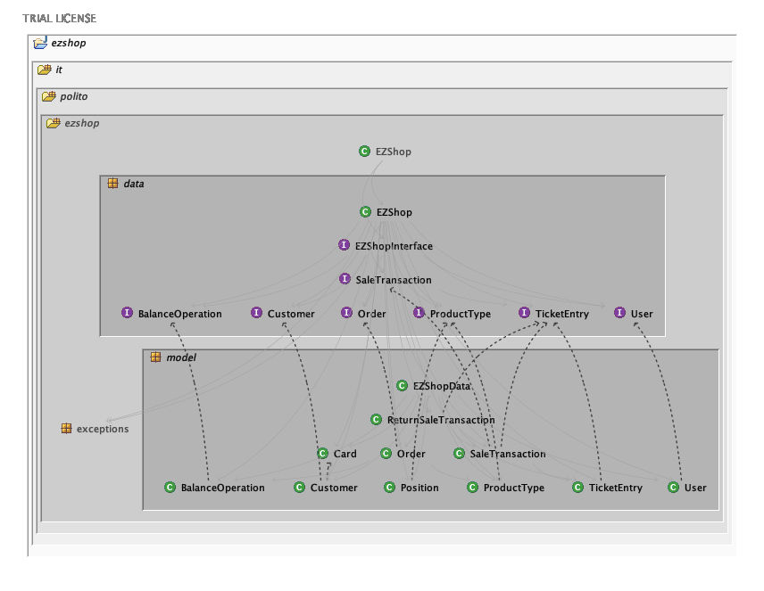
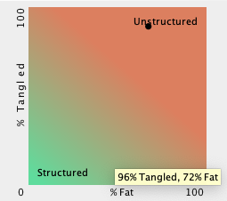
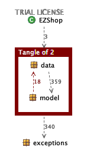
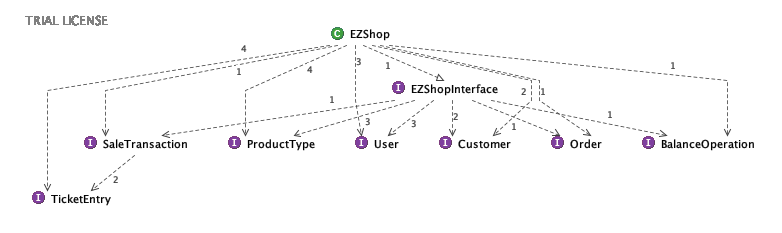
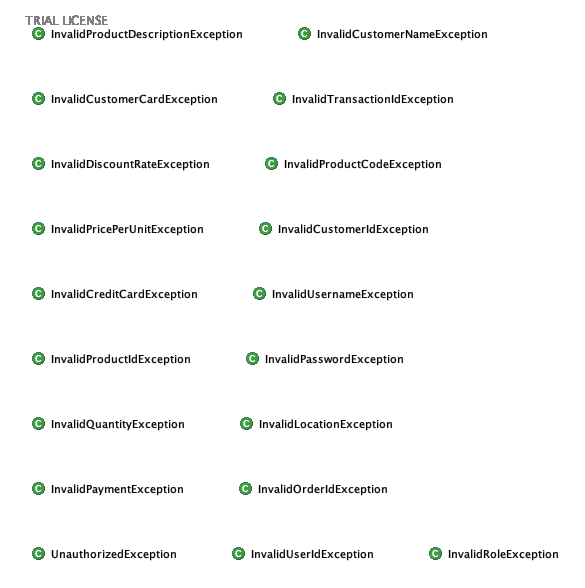
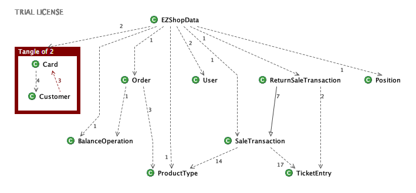

# Design assessment

# Levelized structure map

# Structural over complexity chart

# Size metrics

| Metric                                    | Measure |
| ----------------------------------------- | ------- |
| Packages                                  | 6       |
| Classes (outer)                           | 40      |
| Classes (all)                             | 40      |
| NI (number of bytecode instructions)      | 5088    |
| LOC (non comment non blank lines of code) | 2188    |

# Items with XS

| Item                                | Tangled | Fat  | Size | XS   |
| ----------------------------------- | ------- | ---- | ---- | ---- |
| ezshop.it.polito.ezshop.data.EZShop |         | 142  | 3650 | 565  |
| ezshop.it.polito.ezshop             | 2.50%   |      | 5088 | 127  |

# Package level tangles

ezshop.it.polito.ezshop

ezshop.it.polito.ezshop.data

ezshop.it.polito.ezshop.exceptions

ezshop.it.polito.ezshop.model

# Summary analysis

There are no significant differences with the design delivered on April 30. Minor differences are linked with the visibility of classes and attributes. The tangles are due to the position on interface with respect to the actual implementation. 

