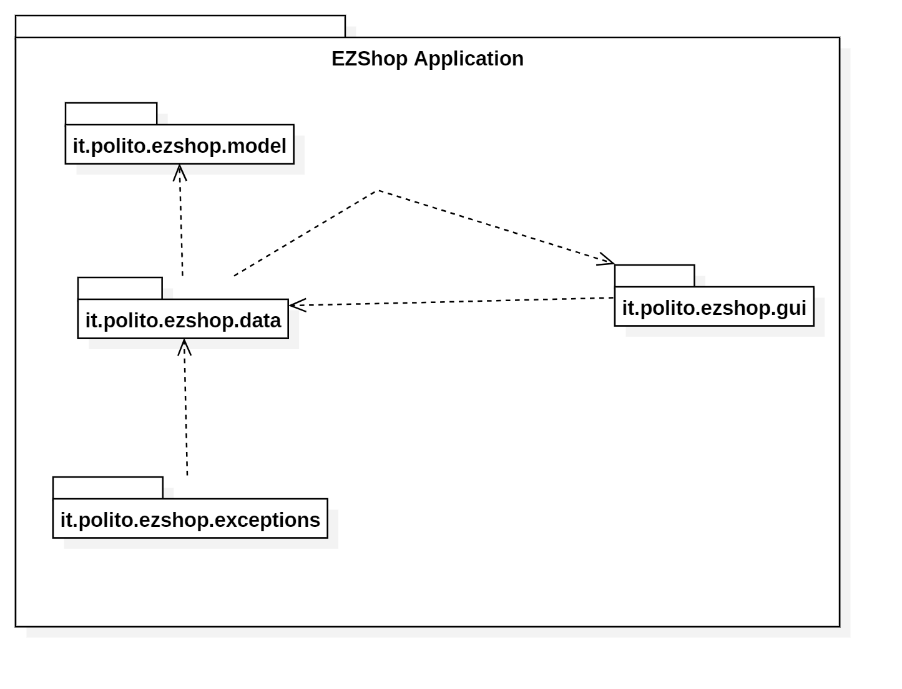
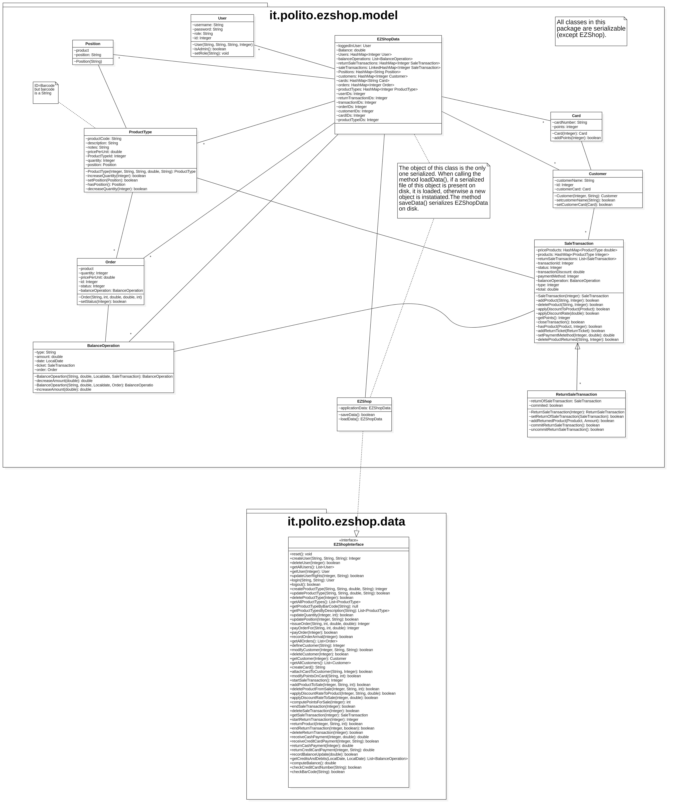
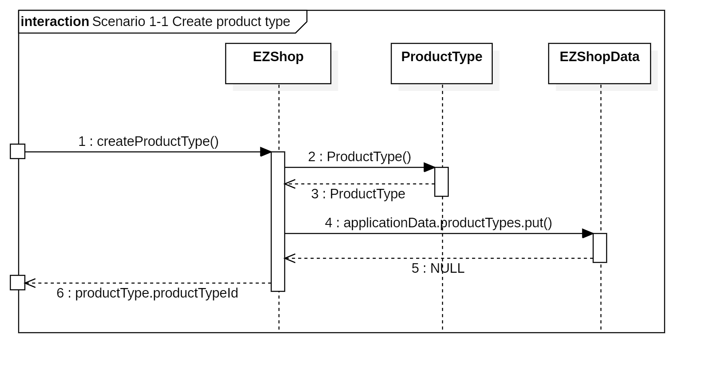
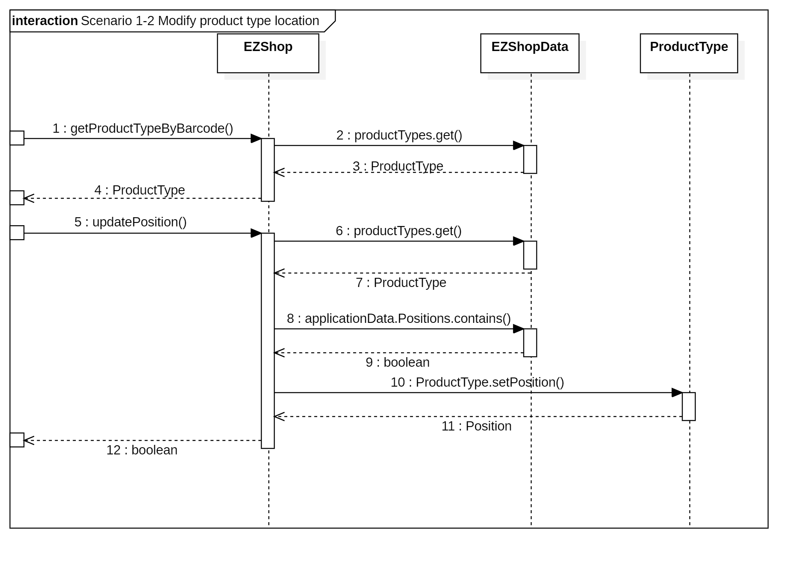
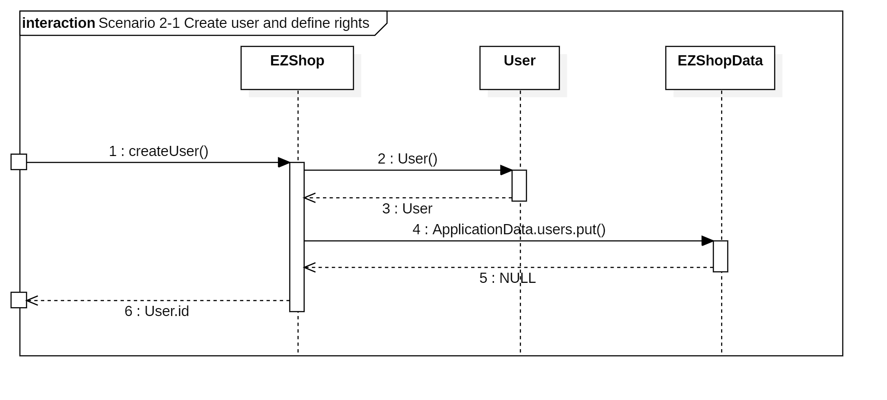
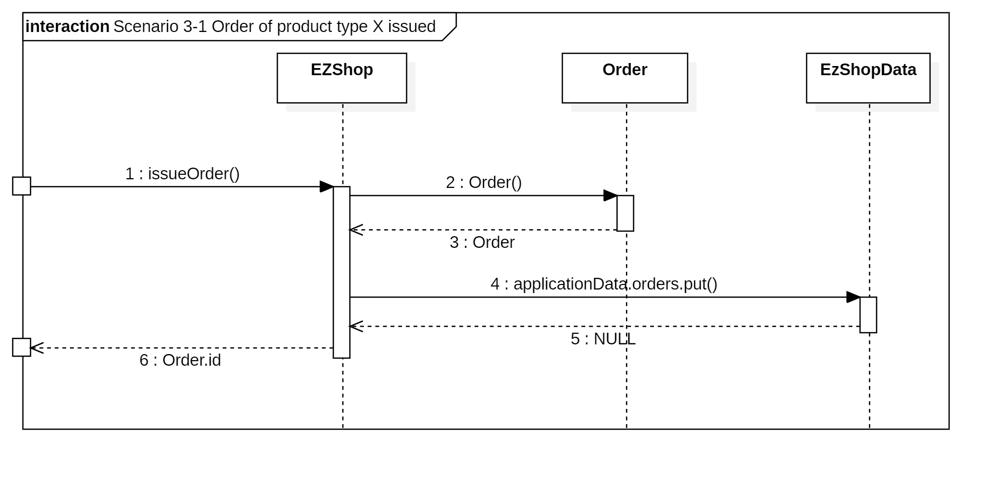
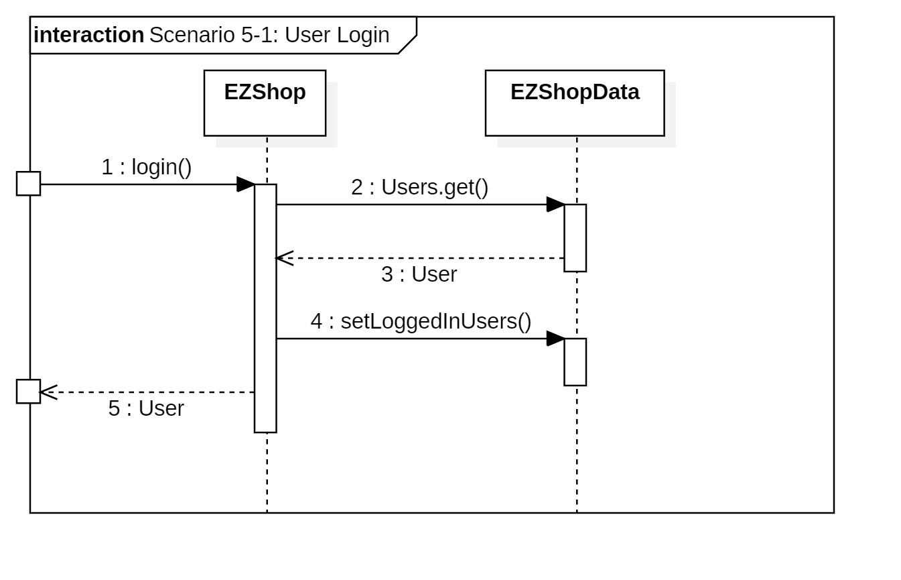
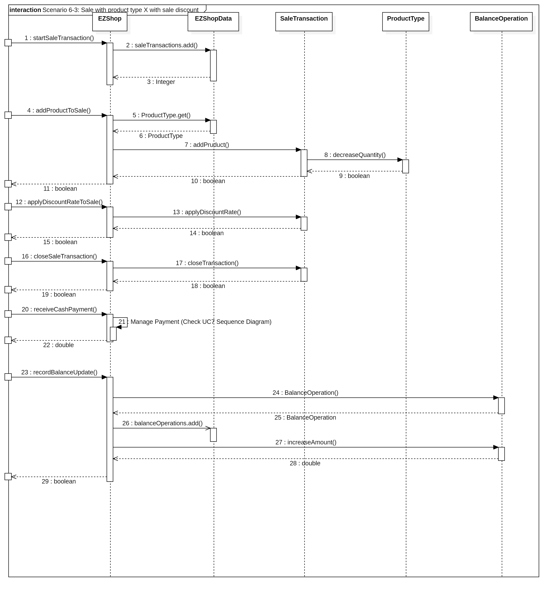
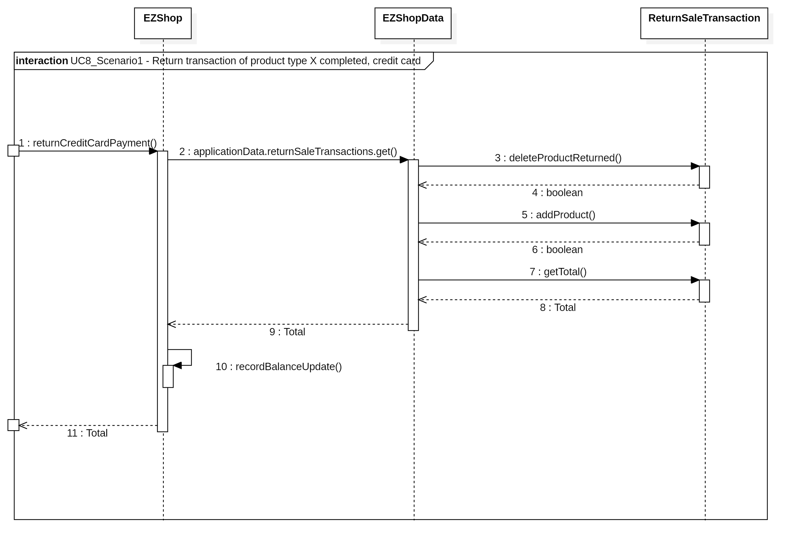
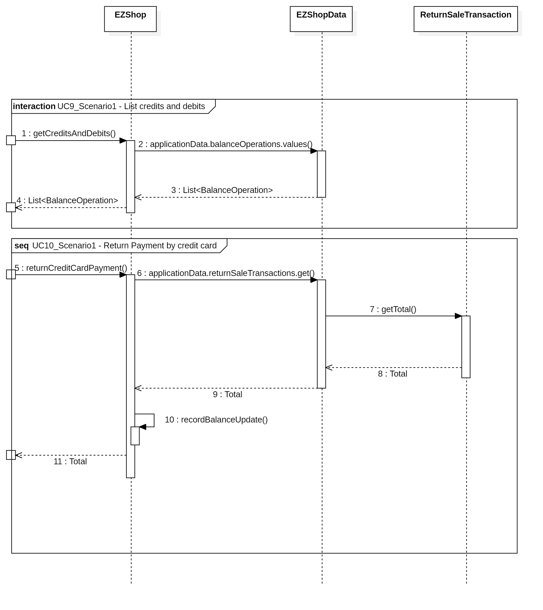

# Design Document 

Authors: Amr Alashram, Davide Perticone, Andrea Taurino, Francesco Vaccaro

Date:30/04/2021

Version:1.0

# Contents

- [High level design](#package-diagram)
- [Low level design](#class-diagram)
- [Verification traceability matrix](#verification-traceability-matrix)
- [Verification sequence diagrams](#verification-sequence-diagrams)

# Instructions

The design must satisfy the Official Requirements document, notably functional and non functional requirements

# High level design 

# Low level design

# Verification traceability matrix

|        | EZShop | SaleTransaction.java | ReturnSaleTransaction.java | ProductType.java | Position.java | Order.java | Customer.java | Card.java | BalanceOperation.java | User |
|--------|:--------:|:----------------------:|:----------------------------:|:------------------:|:---------------:|:------------:|:---------------:|:-----------:|:-----------------------:|:------:|
| FR1    | X      |                      |                            |                  |               |            |               |           |                       | X    |
| FR1.1  | X      |                      |                            |                  |               |            |               |           |                       | X    |
| FR1.2  | X      |                      |                            |                  |               |            |               |           |                       |      |
| FR1.3  | X      |                      |                            |                  |               |            |               |           |                       |      |
| FR1.4  | X      |                      |                            |                  |               |            |               |           |                       |      |
| FR1.5  | X      |                      |                            |                  |               |            |               |           |                       | X    |
| FR3    | X      |                      |                            | X                |               |            |               |           |                       |      |
| FR3.1  | X      |                      |                            | X                |               |            |               |           |                       |      |
| FR3.2  | X      |                      |                            |                  |               |            |               |           |                       |      |
| FR3.3  | X      |                      |                            |                  |               |            |               |           |                       |      |
| FR3.4  | X      |                      |                            |                  |               |            |               |           |                       |      |
| FR4    | X      |                      |                            |                  | X             | X          |               |           |                       |      |
| FR4.1  | X      |                      |                            |                  |               | X          |               |           |                       |      |
| FR4.2  | X      |                      |                            |                  | X             | X          |               |           |                       |      |
| FR4.3  | X      |                      |                            |                  |               |            |               |           |                       |      |
| FR4.4  | X      |                      |                            |                  |               | X          |               |           | X                     |      |
| FR4.5  | X      |                      |                            |                  |               | X          |               |           | X                     |      |
| FR4.6  | X      |                      |                            | X                |               | X          |               |           |                       |      |
| FR4.7  | X      |                      |                            |                  |               |            |               |           |                       |      |
| FR 5   | X      |                      |                            |                  |               |            | X             | X         |                       |      |
| FR5.1  | X      |                      |                            |                  |               |            |               |           |                       | X    |
| FR5.2  | X      |                      |                            |                  |               |            |               |           |                       |      |
| FR5.3  | X      |                      |                            |                  |               |            |               |           |                       |      |
| FR5.4  | X      |                      |                            |                  |               |            |               |           |                       |      |
| FR5.5  | X      |                      |                            |                  |               |            |               | X         |                       |      |
| FR5.6  | X      |                      |                            |                  |               |            | X             | X         |                       |      |
| FR5.7  | X      |                      |                            |                  |               |            |               | X         |                       |      |
| FR6    | X      | X                    |                            | X                |               |            |               | X         | X                     |      |
| FR6.1  | X      | X                    |                            | X                |               |            |               |           |                       |      |
| FR6.2  | X      | X                    |                            | X                |               |            |               |           |                       |      |
| FR6.3  | X      | X                    |                            |                  |               |            |               |           |                       |      |
| FR6.4  | X      | X                    |                            |                  |               |            |               |           |                       |      |
| FR6.5  | X      | X                    |                            |                  |               |            |               |           |                       |      |
| FR6.6  | X      | X                    |                            |                  |               |            |               |           |                       |      |
| FR6.7  |        |                      |                            |                  |               |            |               |           |                       |      |
| FR6.8  |        |                      |                            |                  |               |            |               |           |                       |      |
| FR6.9  | X      |                      |                            |                  |               |            |               |           |                       |      |
| FR6.10 | X      | X                    |                            |                  |               |            |               |           |                       |      |
| FR6.11 | X      | X                    |                            |                  |               |            |               |           |                       |      |
| FR6.12 | X      | X                    |                            |                  |               |            |               |           |                       |      |
| FR6.13 | X      | X                    | X                          |                  |               |            |               |           |                       |      |
| FR6.14 | X      |                      | X                          |                  |               |            |               |           |                       |      |
| FR6.15 | X      |                      | X                          | X                |               |            |               |           |                       |      |
| FR7    | X      |                      |                            |                  |               |            |               |           | X                     |      |
| FR7.1  | X      |                      |                            |                  |               |            |               |           | X                     |      |
| FR7.2  | X      |                      |                            |                  |               |            |               |           | X                     |      |
| FR7.3  | X      |                      |                            |                  |               |            |               |           | X                     |      |
| FR7.4  | X      |                      |                            |                  |               |            |               |           | X                     |      |
| FR8    | X      |                      |                            |                  |               |            |               |           | X                     |      |
| FR8.1  | X      |                      |                            |                  |               |            |               |           | X                     |      |
| FR8.2  | X      |                      |                            |                  |               |            |               |           | X                     |      |
| FR8.3  | X      |                      |                            |                  |               |            |               |           |                       |      |
| FR8.4  | X      |                      |                            |                  |               |            |               |           |                       |      |

# Verification sequence diagrams 
# Scenario 1-1

# Scenario 1-2

# Scenario 2-1

# Scenario 3-1

# Scenario 5-1

# Scenario 6-3

# Scenario 7-1

# Scenario 8-1

# Scenario 9-1 Scenario 10-1

