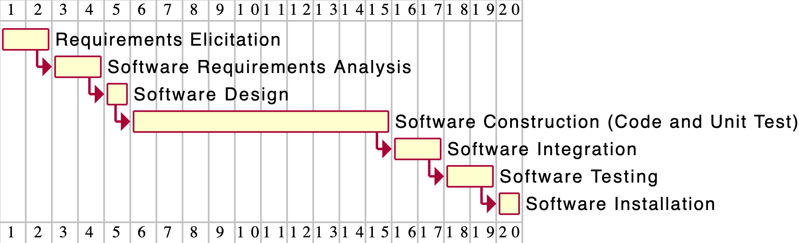

# Project Estimation  
Authors: Amr Alashram, Davide Perticone, Andrea Taurino, Francesco Vaccaro

Date:30/04/2021

Version:1.0

# Contents
- [Estimate by product decomposition]
- [Estimate by activity decomposition ]
# Estimation approach

# Estimate by product decomposition
### 
|             | Estimate                        |             
| ----------- | ------------------------------- |  
| NC =  Estimated number of classes to be developed   |          15 Classes             |             
|  A = Estimated average size per class, in LOC       |          600  LOCs/Class                | 
| S = Estimated size of project, in LOC (= NC * A) | 9000 LOCs    |          
| E = Estimated effort, in person hours (here use productivity 10 LOC per person hour)  |        900 ph                             |   
| C = Estimated cost, in euro (here use 1 person hour cost = 30 euro) | 27000 euro| 
| Estimated calendar time, in calendar weeks (Assume team of 4 people, 8 hours per day, 5 days per week ) |        6 weeks            |               
# Estimate by activity decomposition
### 
|         Activity name    | Estimated effort (person hours)   |             
| ----------- | ------------------------------- | 
| Requirements Elicitation| 30|
| Software Requirements Analysis| 50|
| Software Design| 25|
| Software Construction (Code and Unit Test)| 300|
| Software Integration| 60|
| Software Testing| 45|
|  Software Installation| 15|

