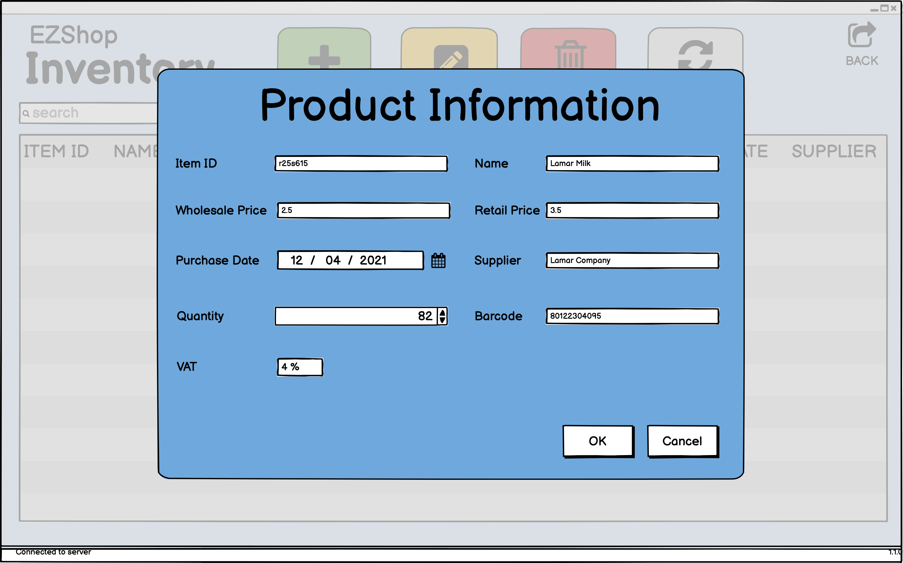

# Graphical User Interface Prototype  

Authors: Amr Alashram, Davide Perticone, Andrea Taurino, Francesco Vaccaro

Date:21/04/2021

Version:1.0

## Clerk performs login operations, UC1

   

## Clerk performs cash-opening procedure, UC2

   

## Logistic employee creates product, UC6

   

## Clerk performs checkout for a customer, UC7

   

## Convert points into prizes at information box, UC9

   

## Insert customer into fidelity program, UC10

   

## Create account for employee, UC11

   

## Report payment of supplier invoice, UC12

