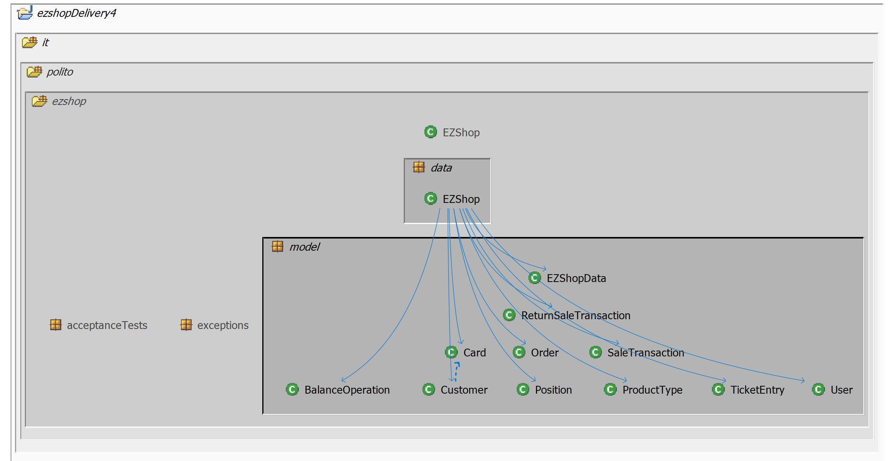

# Integration and API Test Documentation

Authors:

Date:

Version:

# Contents

- [Dependency graph](#dependency graph)

- [Integration approach](#integration)

- [Tests](#tests)

- [Scenarios](#scenarios)

- [Coverage of scenarios and FR](#scenario-coverage)
- [Coverage of non-functional requirements](#nfr-coverage)

# Dependency graph 

# Integration approach

   Approach: Bottom-Up testing
   
   
    step1: Unit Testing
    step2: Integration testing
    step3: API testing
    

#  Tests

## Step 1
| Classes  | JUnit test classes |
| ---------| --------------------|
| User | TestUser|
| TicketEntry|TestTicketEntry|
| ProductType | TestProductType|
| Position | testcheckPosition|
| Order | TestOrder|
|Customer | TestCustomer|
|Card | TestCard| 
| BalanceOperation| TestBalanceOperation|
| SaleTransaction | SaleTransactionUnitTest |
| EZShop::checkPosition | testcheckPostion|
| EZShop::CheckLuhn | TestCheckLuhn|
| EZShop::checkBarcodeValidity | TestCheckBarCode|

## Step 2
| Classes  | JUnit test classes |
| -------- | -------------------- |
| SaleTransaction | SaleTransactionIntegrationTest|
| EZShop::getAllUsers|getAllUsersIntegrationTest|
|EZShop::getUser|getUserIntegrationTest|
|EZShop::UpdateUserRights|UpdateUserRightsIntegrationTest|
|EZShop::logout|logoutIntegrationTest|
|EZShop::login|loginIntegrationTest|
|EZShop::createProductType|createProductTypeIntegrationTest|
|EZShop::updateProduct|updateProductIntegrationTest|
|EZShop::deleteProductType|deleteProductTypeIntegrationTest|
|EZShop::getAllProductType|getAllProductTypeIntegrationTest|
|EZShop::getProductTypeByBarcode|getProductTypeByBarcodeIntegrationTest|
|EZShop::getProductTypeByDescription|getProductTypeByDescriptionIntegrationTest|
|EZShop::updateQuantity|updateQuantityIntegrationTest|
|EZShop::updatePosition|updatePositionIntegrationTest|
|EZShop::issueOrder|issueOrderIntegrationTest|
|EZShop::payOrderFor|payOrderForIntegrationTest|
|EZShop::getAllOrders|getAllOrdersIntegrationTest|
|EZShop::payOrder                   | PayOrderIntegrationTest                   |
|EZShop::recordOrderArrival         | RecordOrderArrivalIntegrationTest         |
| EZShop::getAllOrders               | GetAllOrdersIntegrationTest               |
| EZShop::defineCustomer             | DefineCustomerIntegrationTest             |
| EZShop::modifyCustomer             | ModifyCustomerIntegrationTest             |
|EZShop::deleteCustomer             | DeleteCustomerIntegrationTest             |
| EZShop::getCustomer                | GetCustomerIntegrationTest                |
|EZShop::getAllCustomers            | GetAllCustomersIntegrationTest            |
| EZShop::createCard                 | CreateCardIntegrationTest                 |
| EZShop::attachCardToCustomer       | AttachCardToCustomerIntegrationTest       |
| EZShop::modifyPointsOnCard         | ModifyPointsOnCardIntegrationTest         |
| EZShop::startSaleTransaction       | StartSaleTransactionIntegrationTest       |
| EZShop::addProductToSale           | AddProductToSaleIntegrationTest           |
| EZShop::deleteProductFromSale      | DeleteProductFromSaleIntegrationTest      |
| EZShop::applyDiscountRateToProduct | ApplyDiscountRateToProductIntegrationTest |
|EZShop::applyDiscountRateToSale    | ApplyDiscountRateToSaleIntegrationTest    |
| EZShop::computePointsForSale       | ComputePointsForSaleIntegrationTest       |
| EZShop::endSaleTransaction         | EndSaleTransactionIntegrationTest         |
| EZShop::deleteSaleTransaction                 | DeleteSaleTransactionIntegrationTest                   |
| EZShop::getSaleTransaction         			| GetSaleTransactionIntegrationTest         |
| EZShop::startReturnTransaction              	| StartReturnTransactionIntegrationTest               |
| EZShop::returnProduct             			| ReturnProductIntegrationTest             |
| EZShop::endReturnTransaction             		| EndReturnTransactionIntegrationTest             |
| EZShop::deleteReturnTransaction            	| DeleteReturnTransactionIntegrationTest             |
| EZShop::receiveCashPayment              		| ReceiveCashPaymentIntegrationTest                |
| EZShop::receiveCreditCardPayment            	| ReceiveCreditCardPaymentIntegrationTest            |
| EZShop::returnCashPayment                 	| ReturnCashPaymentIntegrationTest                 |
| EZShop::returnCreditCardPayment       		| ReturnCreditCardPaymentIntegrationTest       |
| EZShop::recordBalanceUpdate         			| RecordBalanceUpdateIntegrationTest         |
| EZShop::getCreditsAndDebits       			| GetCreditsAndDebitsIntegrationTest       |
| EZShop::computeBalance           				| ComputeBalanceIntegrationTest           |

# Scenarios

# Coverage of Scenarios and FR

| Scenario ID | Functional Requirements covered | JUnit  Test(s) | 
| ----------- | ------------------------------- | ----------- | 
|  1.1        | FR3.1            |    createProductTypeIntegrationTest.java      |                      
|  1.2        | FR4.2  FR3.4     |    updatePositionIntegrationTest.java         |        
|     1.3     | FR 3.4 FR3.1     |      updateProductIntegrationTest.java        |    
| 2.1         | FR1.1            |    CreateUserIntegrationTest.java             |       
|    2.2      | FR1.4  FR1.1     |      DeleteUserIntegrationTest.java           | 
| 2.3         | FR1.4  FR1.2     |     ModifyCustomerIntegrationTest.java        |  
| 3.1 | FR4.4 | IssueOrderIntegrationTest |
| 3.2 | FR4.4 | PayOrderIntegrationTest |
| 3.3 | FR4.6, FR4.1 | RecordOrderArrivalIntegrationTest |
| 4.1 | FR5.1 | DefineCustomerIntegrationTest |
| 4.2 | FR5.6 | AttachCardToCustomerIntegrationTest |
| 4.3 | FR5.1 | ModifyCustomerIntegrationTest |
| 4.4 | FR5.1 | ModifyCustomerIntegrationTest |
| 5.1 | FR1 | LoginIntegrationTest |
| 5.2 | FR1 | logoutIntegrationTest |
| 6.1 | FR6.1, FR6.2, FR6.10, FR7, FR8 | StartSaleTransactionIntegrationTest, AddProductToSaleIntegrationTest, EndSaleTransactionIntegrationTest, ReceiveCashPaymentIntegrationTest, RecordBalanceUpdateIntegrationTest |
| 6.2 | FR6.1, FR6.2, FR6.5, FR6.10, FR7, FR8 | StartSaleTransactionIntegrationTest, AddProductToSaleIntegrationTest, EndSaleTransactionIntegrationTest, ReceiveCashPaymentIntegrationTest, RecordBalanceUpdateIntegrationTestApplyDiscountRateToProductIntegrationTest |
| 6.3 | FR6.1, FR6.2, FR6.4, FR6.10, FR7, FR8 | StartSaleTransactionIntegrationTest, AddProductToSaleIntegrationTest, EndSaleTransactionIntegrationTest, ReceiveCashPaymentIntegrationTest, RecordBalanceUpdateIntegrationTestApplyDiscountRateToSaleIntegrationTest |
| 6.4 | FR5.7, FR6.1, FR6.2, FR6.10, FR7, FR8 | StartSaleTransactionIntegrationTest, AddProductToSaleIntegrationTest, EndSaleTransactionIntegrationTest, ReceiveCashPaymentIntegrationTest, RecordBalanceUpdateIntegrationTestModifyPointsOnCardIntegrationTest |
| 6.5 | FR6.1, FR6.2, FR6.10, FR6.11, FR7, FR8 | StartSaleTransactionIntegrationTest, AddProductToSaleIntegrationTest, EndSaleTransactionIntegrationTest, ReceiveCashPaymentIntegrationTest, RecordBalanceUpdateIntegrationTestDeleteSaleTransactionIntegrationTest |
|    7.1      |FR4, FR6, FR7     |    startSaleTransactionIntegrationTest.java , addProductToSaleIntegrationTest.java, endSaleTransactionIntegrationTest.java, receiveCashPaymentIntegrationTest.java, updateQuantityIntegrationTest.java       |
|   7.2       |FR4, FR5, FR6, FR7|    startSaleTransactionIntegrationTest.java , addProductToSaleIntegrationTest.java, endSaleTransactionIntegrationTest.java, receiveCreditCardPaymentIntegrationTest.java, computePointsForSaleIntegrationTest.java, modifyPointsOnCardIntegrationTest.java, updateQuantityIntegrationTest.java       |
|  8.1        | FR5              |        getCustomerIntegrationTest.java        |
|  9.1        | FR8.3            |   GetCreditsAndDebitsIntegrationTest.java     |             
|  10.1       | FR5              |     defineCustomerIntegrationTest.java, createCardIntegrationTest.java,attachCardToCustomerIntegratiionTest.java         |
|  10.2       | FR5              |     defineCustomerIntegrationTest.java        |
            

# Coverage of Non Functional Requirements

### 

| Non Functional Requirement | Test name |
| -------------------------- | --------- |
|       NFR5                     |  TestCheckLuhn.java         |
|NFR4|TestCheckBarCode.java|
|NFR6|CreateUserIntegrationTest.java|

