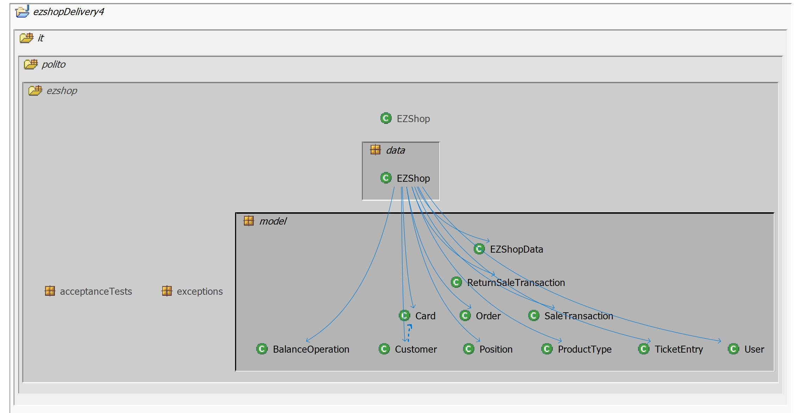

# Integration and API Test Documentation

Authors:

Date:

Version:

# Contents

- [Dependency graph](#dependency graph)

- [Integration approach](#integration)

- [Tests](#tests)

- [Scenarios](#scenarios)

- [Coverage of scenarios and FR](#scenario-coverage)
- [Coverage of non-functional requirements](#nfr-coverage)

# Dependency graph 

# Integration approach

    <Write here the integration sequence you adopted, in general terms (top down, bottom up, mixed) and as sequence
    (ex: step1: class A, step 2: class A+B, step 3: class A+B+C, etc)> 
    <Some steps may  correspond to unit testing (ex step1 in ex above), presented in other document UnitTestReport.md>
    <One step will  correspond to API testing>
    
    step1: Class ReturnSaleTransaction + Class SaleTransaction
    step2: CreateUser
    step3: login
    step4: DeleteUser

#  Tests

   <define below a table for each integration step. For each integration step report the group of classes under test, and the names of
     JUnit test cases applied to them> JUnit test classes should be here src/test/java/it/polito/ezshop

## Step 1 (?????)
| Classes  | JUnit test classes |
| ---------| --------------------|
| User | TestUser|
| TicketEntry|TestTicketEntry|
| ProductType | TestProductType |
| Position |TestPosition|
| Order |TestOrder|
|Customer |TestCustomer|
|Card |TestCard|
| BalanceOperation|TestBalanceOperation|
| SaleTransaction | SaleTransactionUnitTest |
| EZShop : checkPosition | testCheckPosition |
| EZShop : CheckLuhn |TestCheckLuhn|
| EZShop : checkBarcodeValidity | TestCheckBarcode |

## Step 2
| Classes  | JUnit test classes |
| -------- | -------------------- |
| deleteSaleTransaction                 | DeleteSaleTransactionIntegrationTest                   |
| getSaleTransaction         			| GetSaleTransactionIntegrationTest         |
| startReturnTransaction              	| StartReturnTransactionIntegrationTest               |
| returnProduct             			| ReturnProductIntegrationTest             |
| endReturnTransaction             		| EndReturnTransactionIntegrationTest             |
| deleteReturnTransaction            	| DeleteReturnTransactionIntegrationTest             |
| receiveCashPayment              		| ReceiveCashPaymentIntegrationTest                |
| receiveCreditCardPayment            	| ReceiveCreditCardPaymentIntegrationTest            |
| returnCashPayment                 	| ReturnCashPaymentIntegrationTest                 |
| returnCreditCardPayment       		| ReturnCreditCardPaymentIntegrationTest       |
| recordBalanceUpdate         			| RecordBalanceUpdateIntegrationTest         |
| getCreditsAndDebits       			| GetCreditsAndDebitsIntegrationTest       |
| computeBalance           				| ComputeBalanceIntegrationTest           |
| deleteProductFromSale      			| DeleteProductFromSaleIntegrationTest      |
| applyDiscountRateToProduct 			| ApplyDiscountRateToProductIntegrationTest |
| applyDiscountRateToSale    			| ApplyDiscountRateToSaleIntegrationTest    |
| computePointsForSale       			| ComputePointsForSaleIntegrationTest       |
| endSaleTransaction         			| EndSaleTransactionIntegrationTest         |

# Scenarios

# Coverage of Scenarios and FR

<Report in the following table the coverage of  scenarios (from official requirements and from above) vs FR. 
Report also for each of the scenarios the (one or more) API JUnit tests that cover it. >

| Scenario ID | Functional Requirements covered | JUnit  Test(s) |
| ----------- | ------------------------------- | ----------- |
| 5.1 | FR1 | LoginIntegrationTest |
| 5.2 | FR1 | logoutIntegrationTest |
| 6.1 | FR6.1, FR6.2, FR6.10, FR7, FR8 | StartSaleTransactionIntegrationTest, AddProductToSaleIntegrationTest,
 EndSaleTransactionIntegrationTest, ReceiveCashPaymentIntegrationTest, RecordBalanceUpdateIntegrationTest |
| 6.2 | FR6.1, FR6.2, FR6.5, FR6.10, FR7, FR8 | StartSaleTransactionIntegrationTest, AddProductToSaleIntegrationTest,
 EndSaleTransactionIntegrationTest, ReceiveCashPaymentIntegrationTest, RecordBalanceUpdateIntegrationTestApplyDiscountRateToProductIntegrationTest |
| 6.3 | FR6.1, FR6.2, FR6.4, FR6.10, FR7, FR8 | StartSaleTransactionIntegrationTest, AddProductToSaleIntegrationTest,
 EndSaleTransactionIntegrationTest, ReceiveCashPaymentIntegrationTest, RecordBalanceUpdateIntegrationTestApplyDiscountRateToSaleIntegrationTest |
| 6.4 | FR5.7, FR6.1, FR6.2, FR6.10, FR7, FR8 | StartSaleTransactionIntegrationTest, AddProductToSaleIntegrationTest,
 EndSaleTransactionIntegrationTest, ReceiveCashPaymentIntegrationTest, RecordBalanceUpdateIntegrationTestModifyPointsOnCardIntegrationTest |
| 6.5 | FR6.1, FR6.2, FR6.10, FR6.11, FR7, FR8 | StartSaleTransactionIntegrationTest, AddProductToSaleIntegrationTest,
 EndSaleTransactionIntegrationTest, ReceiveCashPaymentIntegrationTest, RecordBalanceUpdateIntegrationTestDeleteSaleTransactionIntegrationTest |

# Coverage of Non Functional Requirements

<Report in the following table the coverage of the Non Functional Requirements of the application - only those that can be tested with automated testing frameworks.>

### 

| Non Functional Requirement | Test name |
| -------------------------- | --------- |
|       NFR5                     |  TestCheckLuhn.java         |
|NFR4|TestCheckBarCode.java|
|NFR6|CreateUserIntegrationTest.java|

