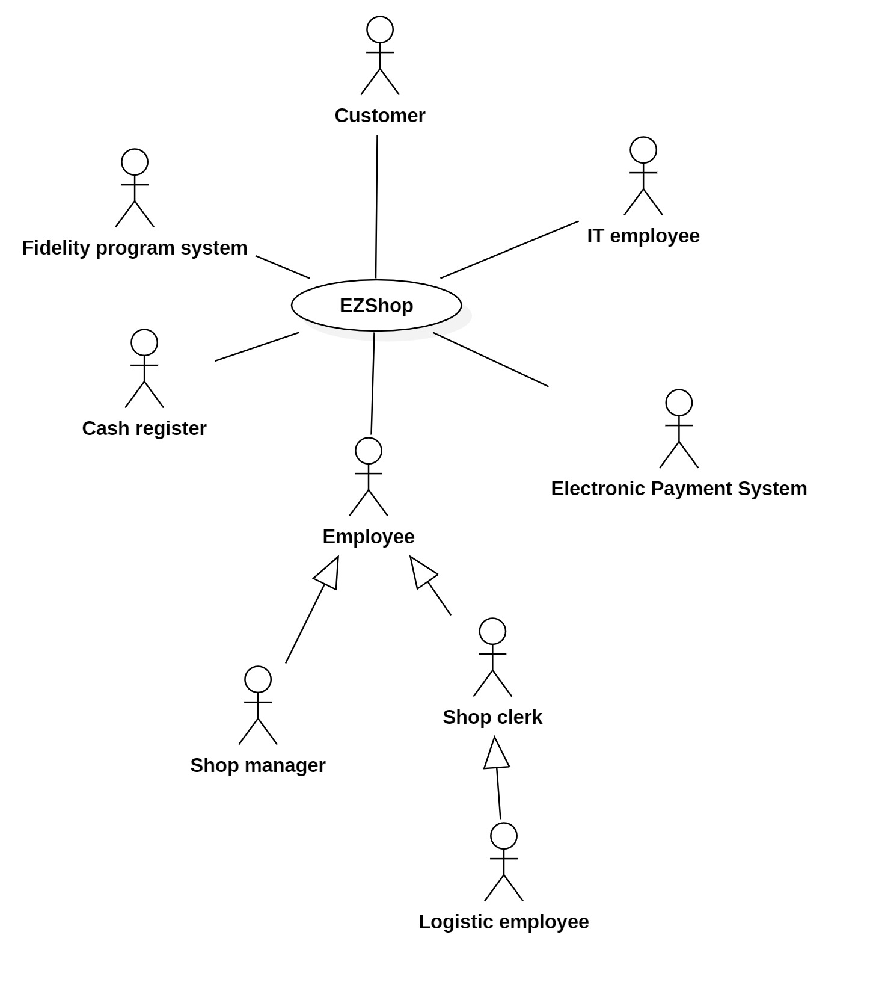

# Requirements Document 

Authors:

Date:

Version:

# Contents

- [Essential description](#essential-description)
- [Stakeholders](#stakeholders)
- [Context Diagram and interfaces](#context-diagram-and-interfaces)
	+ [Context Diagram](#context-diagram)
	+ [Interfaces](#interfaces) 
	
- [Stories and personas](#stories-and-personas)
- [Functional and non functional requirements](#functional-and-non-functional-requirements)
	+ [Functional Requirements](#functional-requirements)
	+ [Non functional requirements](#non-functional-requirements)
- [Use case diagram and use cases](#use-case-diagram-and-use-cases)
	+ [Use case diagram](#use-case-diagram)
	+ [Use cases](#use-cases)
    	+ [Relevant scenarios](#relevant-scenarios)
- [Glossary](#glossary)
- [System design](#system-design)
- [Deployment diagram](#deployment-diagram)

# Essential description

Small shops require a simple application to support the owner or manager. A small shop (ex a food shop) occupies 50-200 square meters, sells 500-2000 different item types, has one or a few cash registers 
EZShop is a software application to:
* manage sales
* manage inventory
* manage customers
* support accounting

# Stakeholders

| Stakeholder name  | Description | 
| ----------------- |:-----------:|
| Shop owner(s)     |   Person(s) owning the shop          |
| Shop manager(s)| Person(s) managing the shop |
| Shop clerks | People working at cash registers |
| Logistic employees | People working in the logistic department |
| IT employee(s) | Person(s) in charge of installing/maintaining IT infrastructure  |
| Electronic Payment system(s)  | IT system(s) (credit card and/or meal vouchers) to process various electronic payments|
| Customer | Whoever buys something from the market |
| Cash register | Cash register hardware integration  |
| Software developer(s)/mainter(s) | Whoever is involved in the development of the app |
| Fidelity program circuit | The fidelity program that the market uses to retain customers(may be common to many markets) | 

# Context Diagram and interfaces

## Context Diagram

\<actors are a subset of stakeholders>

## Interfaces
\<describe here each interface in the context diagram>

\<GUIs will be described graphically in a separate document>

| Actor | Logical Interface | Physical Interface  |
| ------------- |:-------------:| -----:|
| Shop manager    | GUI  | Screen, keyboard, mouse |
| Shop clerks | GUI | Touchscreen display, cash register |
| Logistic employees | GUI |Screen, keyboard, mouse |
| IT employee(s) | GUI | Screen, keyboard, mouse |
| Electronic Payment system(s) | API | Internet cable and POS hardware | 
| Cash register | API | Connectors |
| Fidelity Program system | API | Internet cable |
| Customer | GUI | Mini-display of cash register |

# Stories and personas
\<A Persona is a realistic impersonation of an actor. Define here a few personas and describe in plain text how a persona interacts with the system>

--Customer

A customer enters the supermarket to buy some products. While walking inside te market to take what he needs, he/she can check the price of a product using the bar code scanner(s) placed somewhere (in case the price is not written clearly below the product). After taking all the products he/she wants, the customer goes to the cashier in order to initiate the check-out process. While the clerk scans all the products, the customer can check the price of each single scanned product in the mini-display put on the cash desk. Then, the customer must pay with cash, credit card or food voucher. After payment the check-out is complete.

--Cashier 

A clerk, when working at the cash desk, must login in the application in order to use it. If it is the first login of the day, a cash-opening procedure must be performed (the amounts of money in the cash register is reported in the application to allow automatic counting). Then, he/she waits for customers to show up. When a customer shows up, the clerk starts scanning all products. In front of him, a touchscreen display (connect to a computer) is available, in order to manage the check out process. Various options are present, such as remove items, apply discounts and so on. While scanning products (at the end, in between or at the start) the customer can show the fidelity card and the cashier can scan it in order to link the transaction to the customer. Some additional info are present if the the fidelity card is scanned (such as overall points and not sensible data). After all products have been scanned, the cashier  selects the payment the customer desires to pay with and con continue with the check-out. After the payment completes, a receipt is printed and the check-out ends. At the of the day or when he/she needs, the clerk must logout from the system. At the end of the day, the cashier must perform a cash-closing procedure. It consists in counting all money inside the cash register and check if the amount is the same the system has calculated throughout the day. In case of inconsistency the shop manager must deal with it.

--Logistic employee
A logistic can login into the system and has access to the inventory. He/She can performs some operation on it. I has Create, Read, Update or Delete a product
inside the inventory. When a new product is delivered to the supermarket, the logist employee accesses the inventory and uses the function create new product.
He/She inserts all necesseray data (price, name, producer, bar code...) and define the available amount of it. The new product is now present in the inventory. The logistic employee may also Update some information of the product following by visualizing it and clicking on the edit button in the page. Eventually he/she can delete a product by clicking on the delete button. During the delition, some conflicts may arise (a product has some available units) and the he/she must decide wether to definitely remove and loose track of the quantities still available or to move a list of deleted items still present in the market.

\<Persona is-an-instance-of actor>

\<stories will be formalized later as scenarios in use cases>

# Functional and non functional requirements

## Functional Requirements

\<In the form DO SOMETHING, or VERB NOUN, describe high level capabilities of the system>

\<they match to high level use cases>

| ID        | Description  |
| ------------- |:-------------:| 
| FR1 | Authorize and authenticate cashier |
| | Log in |
| | Log out |
| | Perfrom cash-opening procedure|
| | Perform cash-closing procedure |
| | Update amount of cash in the cash register| 
| FR2 | Check-out of a customer |
| | Start new check-out |
| | Scan a product/fidelity card | 
| | Remove scanned product |
| | Apply discount on product |
| | Cancel check-out transaction | 
| | Put transaction on hold |
| | Keep track of scanned products|
| | Compute total cost |
| | Select payment method | 
| | Insert number of voucher |
| | Show fidelity card info (points, name...)|
| | Print receipt |
| | Update inventory (done automatically)*|
| | Update fidelity card points (done automatically) |
| | Insert manual barcode |
| | View open check-outs |
| | Delete check-out | 
| | Close check out |
| | Show screen calculator | 
| FR3 | Manage return of a product |
| | Delete product from a already carried-out transaction |
| | Update inventory (done automatically)*|
| FR4 | Manage inventory |
| | Add new product |
| | Delete product |
| | Update Product |
| | Add Product quantity |
| | Show list of suppliers | 
| | Show product supplied by supplier |
| | Show list of items (and related info)|
| | Show value (in money) of inventory |
| FR5 | Manage customer (in fidelity program) | 
| | Add new customer |
| | Delete customer |
| | Update customer | 
| | Show points of a customer|
| | Convert points to prizes |

## Non Functional Requirements

\<Describe constraints on functional requirements>

| ID        | Type (efficiency, reliability, ..)           | Description  | Refers to |
| ------------- |:-------------:| :-----:| -----:|
|  NFR1     | Efficiency  | Allow to close check-out and select payment in less than 10 sec.  | FR2|
|  NFR2     | Usability| An average clerk must be able to fully use the program after 1 hour explanation  | FR1-FR2 |
|  NFR3     | Efficiency | The clerk module of the application must be able to run on low-end computers | FR1  |
|  NFR4     |  Reliability | The application must be able to function without internet/internal connection for long periods of time   | FR2-FR1*-FR4-FR5| 
| NFR6 | Correctness | The application must be able to synch with the inventory without conflicts | |
| NFR7 | Maintanainability | The deployment of the application must be done in no more than 15 working hours | |
| NFR6 | Maintanainbility | All CRUD operations must be possible to be carried out within 1 minute | |
| NFR7 | Security | Personnel must be able to enter just the portion of program it is authorized to|  |
| NFR8 | Security | Sensible data (such as name, surname, birth) must be shown to personell only when those date are useful and needed during the process|  |
| NFR9 | Reliability | The application must perform backups of everything it is important and store it in a secure location (maybe cloud) | |
| NFR10 | Reliability | The application must work even when an inventory update is being carried out and must not create conflicts after update | |
# Use case diagram and use cases

## Use case diagram
\<define here UML Use case diagram UCD summarizing all use cases, and their relationships>

\<next describe here each use case in the UCD>
### Use case Clerk performs login operations, UC1
| Actors Involved        | Shop clerk  |
| ------------- |:-------------:| 
| | |
|  Precondition     | The whole system is up and running |  
|  Post condition     | The shop clerk is logged in the system |
|  Nominal Scenario     | The shop clerks inserts username and password on the touch screen attached to the cash register. If the U/P are correct the system allows the log in |
|  Variants     | The U/P are not correct|
| | After 5 unsuccessful tries the system blocks|
| | The manager must perform the log in in order to unlock the system and allow others to login |

### Clerk performs cash-opening procedure, UC2
| Actors Involved        | Shop clerk  |
| ------------- |:-------------:| 
| | |
|  Precondition     | The clerk is logged in the system, the last operation performed is a cash-closing procedure |  
|  Post condition     | The system is ready to perform checkout operations |
|  Nominal Scenario     | The shop clerk initiates the procedure and counts all the money inside the cash register, and inserts the amount in the proper field on the touch screen |

### Clerk performs cash-closing procedure, UC3
| Actors Involved        | Shop clerk  |
| ------------- |:-------------:| 
| | |
|  Precondition     | The clerk is logged in the system, the last operation performed is a cash-opening procedure |  
|  Post condition     | The system is not able to perform checkout operations |
|  Nominal Scenario     | The shop clerk initiates the procedure and counts all the money inside the cash register, and inserts the amount in the proper field on the touch screen, the amount is correct (Amount at cash-opening+earning[cash]=amount at cash-closing) and the cash - closing procedure ends succesfully |
|  Variant     |  The shop clerk initiates the procedure and counts all the money inside the cash register, and inserts the amount in the proper field on the touch screen, the amount is not correct (Amount at cash-opening+earning[cash]=amount at cash-closing) an error message is shown and the cash-closing procedure is not performed. Only the manager has the right to perform this operation anyway |

### Customer checks price ad bar code scanner inside market, UC4
| Actors Involved        | Customer  |
| ------------- |:-------------:| 
| | |
|  Precondition     | The whole system is up and running, the barcode scanner must be working and connected to the system |  
|  Post condition     | The barcode scanner display shows the price of the scanned item |
|  Nominal Scenario     | The customer takes a product and scans its barcode on the barcode scanner, the price is displayed |
|  Variant        | The customer takes a product and scans its barcode on the barcode scanner, the price is not displayed because the product is not in the inventory and a "Go to information box" message is shown |
| Variant |    The customer takes a product and attempts to scan its barcode on the barcode scanner, but the barcode is corrupt and no message is shown on the barcode reader display |

### Manager handles return of a product, UC5
| Actors Involved        | Shop manager, customer, cash register  |
| ------------- |:-------------:| 
| | |
|  Precondition     | The customer has the cashout receipt and the product  |  
|  Post condition     | The item is returned, the quantity in the inventory is updated and the money is returned to the customer |
|  Nominal Scenario     | The customer brings the product to the store manager, shows the receipt, the manager accepts the return request, the manager scans the product, the system updates the inventory and the money is returned. After completing the procedure, the system updates the amount of money inside the cash register (used to perform the return) |
|  Variant        | The customer brings the product to the store manager, shows the receipt, the product is visibly used and the manager declines the return request |
|  Variant    | The customer brings the product to the store manager, shows the receipt, the manager accepts the return request, the manager scans the product, the system updates the inventory and a store credit barcode is emitted |

### Logistic employee create product, UC6
| Actors Involved        | Shop manager, logistic employee  |
| ------------- |:-------------:| 
| | |
|  Precondition     | The product does not exist in the inventory (yet)  |  
|  Post condition     | The product is added in the inventory |
|  Nominal Scenario     | The (logistic) employee clicks "add new product", inserts all the necessary data (name, producer, category, barcode, price....), confirms the operation and the inventory is updated |

### Clerk performs checkout for a customer, UC7
| Actors Involved        | Clerk, customer, fidelity card system, Electronic Payment System, cash register  |
| ------------- |:-------------:| 
| | |
|  Precondition     | The clerk is succesfully logged in the system and the cash-opening procedure has been performed before   |  
|  Post condition     | The checkout procedure ends and the inventory is updated |
|  Nominal Scenario     | The clerk scans the products (the customer can check the price of each item on the cash register display) and, eventually, the fidelity card; the system computes the total, the clerk selects cash as paying method, the cashout procedure ends,  the inventory is updated and a receipt is printed |
| Variant |   The clerk scans the products (the customer can check the price of each item on the cash register display) and, eventually, the fidelity card; the system computes the total, the clerk selects Credit Card as paying method, the customer authorizes the transaction by inserting the card (and the PIN, eventually) in the POS; the system receives a confirmation of the payment from the POS, the cashout procedure ends, the inventory is updated and a receipt is printed  |
| Variant |  The clerk scans the products (the customer can check the price of each item on the cash register display) and, eventually, the fidelity card; the system computes the total, the clerk selects Electronic Voucher as paying method, the customer authorizes the transaction by inserting the voucher card (and the PIN, eventually) in the POS; the system receives a confirmation of the payment from the POS, if the amount that must be paid is greater than the vouchers' value, the difference must be paid either by cash or credit card, otherwise if the amount is less, the difference is lost; then the cashout procedure ends, the inventory is updated and a receipt is printed  |
| Variant |  The clerk scans the products (the customer can check the price of each item on the cash register display) and the fidelity card; the system computes the total, the clerk selects Store Credit as paying method, scans the Store Credits' barcode and the system receives a confirmation of its validity; if the amount that must be paid is greater than the store credit value, the difference must be paid either by cash or credit card, otherwise if the amount is less, the difference is lost; then the cashout procedure ends, the inventory is updated and a receipt is printed  |

### Convert points into prizes at information box, UC9
| Actors Involved        | Shop clerk/manager, customer, fidelity card system  |
| ------------- |:-------------:| 
| | |
|  Precondition     | The clerk/manager is logged in the fidelity card system, the customer has a fidelity card with enough points to be converted in store credit ( at least N points ->  N points = 1 euro ) |  
|  Post condition     | The amount of points converted in store credit is deducted from the customer's fidelity card, a store credit barcode is printed |
|  Nominal Scenario     | The shop manager/clerk at the information box scans the fidelity card, the fidelity card holder information and the available points are shown on the display, the manager/clerk inserts the desired amount M in euros (1 euro for N points, M is integer), M*N points are deducted from the fidelity card available points and a store credit receipt with a barcode is printed |
|  Variant     |  The shop manager/clerk at the information box scans the fidelity card, the fidelity card holder information and the available points are shown on the display; the manager/clerk inserts the desired amount M in euros (1 euro for N points), M*N is greater than the available points, an error message is shown and the shop manager/clerk is prompted to insert a correct value |

### Insert customer into fidelity program, UC10
| Actors Involved        | Shop manager, customer, fidelity program system  |
| ------------- |:-------------:| 
| | |
|  Precondition     | The fidelity program system is up and running |  
|  Post condition     | The customer is present in the fidelity program |
|  Nominal Scenario     | The customer goes to the information box asking for a new fidelity card, the shop manager logs in the system, the customer submits his sensible data(name,surname,birth), the system checks if the customer is already present. If the customer is not present a new fidelity card is assigned to the customer |
| Variant | If the customer is already present, but he lost his previous fidelity card, the system tries to recover the informations of the previous card (points, prizes,...) and to include these informations in the new fidelity card |

### Check points of fidelity card at bar code scanner, UC11
| Actors Involved        | Shop clerk, customer, fidelity card system  |
| ------------- |:-------------:| 
| | |
|  Precondition     | The customer has the fidelity card of the shop, the fidelity program system is working, and the barcode scanner is working and connected to fidelity system|  
|  Post condition     | The number of points of the card, the card serial number, the last name of the customer, and the date of expiry are shown at the screen |
|  Nominal Scenario     | The shop clerk and/or the customer at the barcode scanner system scans the fidelity card, the fidelity card holder lastname, the number of points in the card balance, and the card's serial number are shown on the display |
|  Variant  1   |  The shop clerk and/or the customer at the barcode scanner system scans the fidelity card, but the barcode is corrupted, then a message of "Corrupted barcode" is displayed on the screen |
|  Variant  2   |  The shop clerk and/or the customer at the barcode scanner system scans the fidelity card, but the card is expired, then a message of "Expired Card" is displayed on the screen |

USE CASES:
- Clerk performs login operations X
- Clerk performs cash-opening/closing procedure X
- Clerk performs checkout for a customer X
- Customer checks price ad bar code scanner inside market X
- Clerk manages return of a product  X
- Logistic employee CRUD product X(create)

- Check points of fidelity card at bar code scanner AMR
- Convert points into prizes at information box ANDREA
- Insert customer into fidelity program FRANCESCO
-
-

##### Scenario 1.1 

\<describe here scenarios instances of UC1>

\<a scenario is a sequence of steps that corresponds to a particular execution of one use case>

\<a scenario is a more formal description of a story>

\<only relevant scenarios should be described>

| Scenario 1.1 | |
| ------------- |:-------------:| 
|  Precondition     | \<Boolean expression, must evaluate to true before the scenario can start> |
|  Post condition     | \<Boolean expression, must evaluate to true after scenario is finished> |
| Step#        | Description  |
|  1     |  |  
|  2     |  |
|  ...     |  |

##### Scenario 1.2

##### Scenario 1.x

### Use case 2, UC2
..

### Use case x, UCx
..

# Glossary

-Check-out
-Shop-clerk
-Shop manager
-Logistic employee
-Bar code scanner inside market
-cash-opening/closing procedure
-Fidelity card
-Fidelity points
-CRUD 
-Supplier

\<use UML class diagram to define important terms, or concepts in the domain of the system, and their relationships> 

\<concepts are used consistently all over the document, ex in use cases, requirements etc>

# System Design
\<describe here system design>

\<must be consistent with Context diagram>

# Deployment Diagram 

