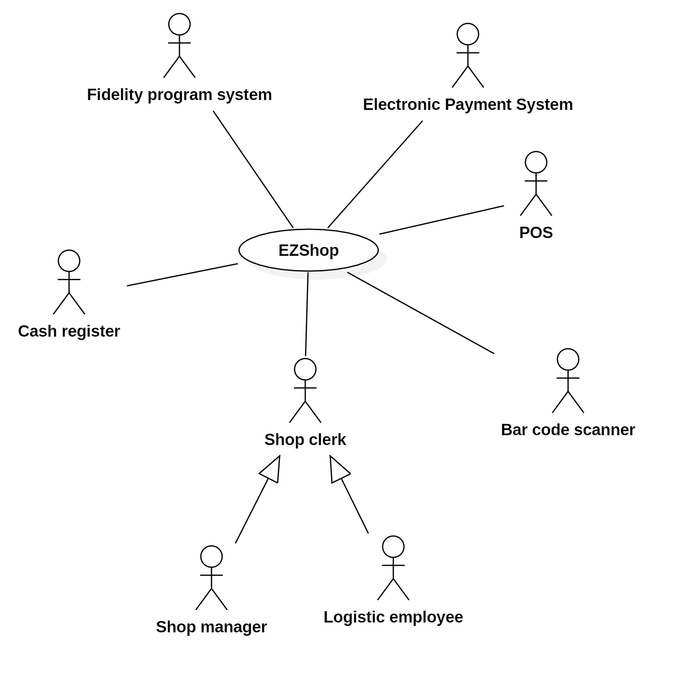
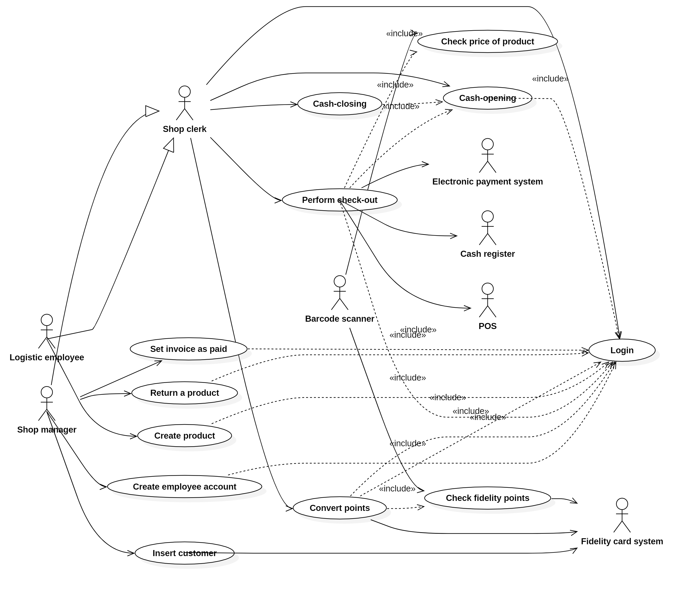

# Requirements Document 

Authors: Amr Alashram, Davide Perticone, Andrea Taurino, Francesco Vaccaro 

Date: 21/01/2021

Version: 1.0

# Contents

- [Essential description](#essential-description)
- [Stakeholders](#stakeholders)
- [Context Diagram and interfaces](#context-diagram-and-interfaces)
	+ [Context Diagram](#context-diagram)
	+ [Interfaces](#interfaces) 
	
- [Stories and personas](#stories-and-personas)
- [Functional and non functional requirements](#functional-and-non-functional-requirements)
	+ [Functional Requirements](#functional-requirements)
	+ [Non functional requirements](#non-functional-requirements)
- [Use case diagram and use cases](#use-case-diagram-and-use-cases)
	+ [Use case diagram](#use-case-diagram)
	+ [Use cases](#use-cases)
- [Glossary](#glossary)
- [System design](#system-design)
- [Deployment diagram](#deployment-diagram)

# Essential description

Small shops require a simple application to support the owner or manager. A small shop (ex a food shop) occupies 50-200 square meters, sells 500-2000 different item types, has one or a few cash registers 
EZShop is a software application to:
* manage sales
* manage inventory
* manage customers
* support accounting

# Stakeholders

| Stakeholder name  | Description | 
| ----------------- |:-----------:|
| Shop owner(s)     |   Person(s) owning the shop          |
| Shop manager(s)| Person(s) managing the shop |
| Shop clerks | People working at cash registers |
| Logistic employees | People working in the logistic department |
| IT employee(s) | Person(s) in charge of installing/maintaining IT infrastructure  |
| Electronic Payment system(s)  | IT system(s) (credit card and/or meal vouchers) to process various electronic payments|
| Customer | Whoever buys something from the market |
| Cash register | Hardware device where that stores money and print receipts  |
| Software developer(s)/mainter(s) | Whoever is involved in the development of the app |
| Fidelity program circuit | The fidelity program that the market uses to retain customers(may be common to many markets) | 
| Barcode scanner | Hardware device to scan products' barcode|
| Product | Products sold by the supermarket |
| POS credit card | Hardware device to accept credit cards |
# Context Diagram and interfaces

## Context Diagram

\<actors are a subset of stakeholders>

## Interfaces

| Actor | Logical Interface | Physical Interface  |
| ------------- |:-------------:| -----:|
| Shop manager    | GUI  | Screen, keyboard, mouse |
| Shop clerks | GUI | Touchscreen display, cash register |
| Logistic employees | GUI |Screen, keyboard, mouse |
| Electronic Payment system(s) | API | Internet cable | 
| Cash register | API | LAN Connectors |
| Fidelity Program system | API | Internet cable |
| Barcode scanner | API | Cable |
| POS credit card | API | Cable |

# Stories and personas

- Manager

The manager is the one in charge of the supermaket. He/she must supervise everything. When a new clerk is hired, the manager must someway give to the new employee an account to log in the application to carry out daily operations. The manager wants this to be a quick and painless procedure, without the need to insert too much date.
He also wants to set up privileges for the account, as the employee must no be able to access some part of the application.
The manager is also in charge of returns. Typically, a customer shows up at any time with a recipt and the product(s) to return. The supermarket does not earn money from this operation, so the manager must be quick in dealing with it. He/she wants to tell the application to initiate a product, scan the barcode of the product and return the money to the customer. He/she does not want to deal with updating the inventory, the amount of money in the cash register and so on.
The manager can also deal with converting fidelity points into prizes for the customer. Again, this procedure is just a way to attract more customer, but the supermarket does not earn anything (directly). The manager wants to be able to do this procedure in less than 1 minute. He/she just wants to scan the fidelity card of the customer and convert the points into credit store.

- Shop clerk 

A clerk, when working at the cash desk, must login in the application in order to use it. If it is the first login of the day, a cash-opening procedure must be performed (the amounts of money in the cash register is reported in the application to allow automatic counting). Then, he/she waits for customers to show up. When a customer shows up, the clerk starts scanning all products. In front of him, a touchscreen display (connect to a computer) is available, in order to manage the check out process. Various options are present, such as remove items, apply discounts and so on. While scanning products (at the end, in between or at the start) the customer can show the fidelity card and the shop clerk can scan it in order to link the transaction to the customer. Some additional info are present if the the fidelity card is scanned (such as overall points and not sensible data). After all products have been scanned, the shop clerk  selects the payment the customer desires to pay with and con continue with the check-out. After the payment completes, a receipt is printed and the check-out ends. At the of the day or when he/she needs, the clerk must logout from the application. At the end of the day, the shop clerk must perform a cash-closing procedure. It consists in counting all money inside the cash register and check if the amount is the same the application has calculated throughout the day. In case of inconsistency the shop manager must deal with it.

- Logistic employee

A logistic can login into the application and has access to the inventory. He/She can performs some operation on it. I has Create, Read, Update or Delete a product
inside the inventory. When a new product is delivered to the supermarket, the logist employee accesses the inventory and uses the function create new product.
He/She inserts all necesseray data (price, name, producer, barcode...) and define the available amount of it. The new product is now present in the inventory. The logistic employee may also Update some information of the product following by visualizing it and clicking on the edit button in the page. Eventually he/she can delete a product by clicking on the delete button. During the delition, some conflicts may arise (a product has some available units) and the he/she must decide wether to definitely remove and loose track of the quantities still available or to move a list of deleted items still present in the market.

# Functional and non functional requirements

## Functional Requirements

| ID        | Description  |
| ------------- |:-------------:| 
| FR1 | Authorize and authenticate shop clerk |
| FR1.1| Log in |
| FR1.2| Log out |
| FR1.3| Perform cash-opening procedure|
| FR1.4| Perform cash-closing procedure |
| FR1.5| Update amount of cash in the cash register| 
| FR2 | Manage check-out of a customer |
| FR2.1| Start new check-out |
| FR2.2| Scan a product/fidelity card | 
| FR2.3| Remove scanned product |
| FR2.4| Apply discount on product |
| FR2.5| Cancel check-out transaction | 
| FR2.6| Put transaction on hold |
| FR2.7| Add product to scanned products|
| FR2.8| Compute total cost |
| FR2.9| Select payment method | 
| FR2.10| Insert number of voucher |
| FR2.11| Show fidelity card info (points, name...)|
| FR2.12| Print receipt |
| FR2.13| Update fidelity card points  |
| FR2.15 | Update balance of cash register |
| FR2.15| Insert manual barcode |
| FR2.16| View open check-outs |
| FR2.17| Delete check-out | 
| FR2.18| Close check out |
| FR2.19| Show screen calculator | 
| FR2.20 | Get product code |
| FR3 | Manage return of a product |
| FR3.1| Delete product from a already carried-out transaction |
| FR4 | Manage inventory |
| FR4.1| Add new product |
| FR4.2| Delete product |
| FR4.3| Update Product |
| FR4.4| Add Product quantity |
| FR4.5| Show list of suppliers | 
| FR4.6| Show product supplied by supplier |
| FR4.7| Show list of items (and related info)|
| FR4.8| Show value (in money) of inventory |
| FR4.9| Get price of product |
| FR4.10| Remove product quantity from inventory|
| FR5.1 | Manage customer (in fidelity program) | 
| FR5.2| Add new customer |
| FR5.3| Delete customer |
| FR5.4| Update customer | 
| FR5.5| Show points of a customer|
| FR5.6| Convert points to prizes |
| FR6 | Manage shop clerk accounts |
| FR6.1| Add new account |
| FR6.2 | Delete account |
| FR6.3 | Edit account privileges |
| FR6.4 | Block account |
| FR6.5 | View account statistics |
| FR6.6 | View account list |
| FR6.7 | View account privileges |
| FR7 | Manage client settings |
| FR7.1 | View connection to server status |
| FR7.2 | Modify server connection parameters |
| FR7.3 | View connection to internet status |
| FR8 | Manage application |
| FR9 | Manage accounting |
| FR9.1 | View all the transactions |
| FR9.2 | Manage the cash flow movement |
| FR9.3 | Add invoice |
| FR9.4 | Edit invoice |
| FR9.6 | Display invoices |
| FR9.7| Set invoice as paid |

## Non Functional Requirements

| ID        | Type (efficiency, reliability, ..)           | Description  | Refers to |
| ------------- |:-------------:| :-----:| -----:|
|  NFR1     | Efficiency  | Allow to close check-out and select payment in less than 5 sec.  | FR2|
|  NFR2     | Usability| An average clerk must be able to fully use the program after 1 hour explanation  | All FR |
|  NFR3     | Efficiency | Thee application must be able to run on low-end computers | All FR  |
|  NFR4     |  Reliability | The checkout part of the application must be able to function without internet/internal connection for at least 1 hour   | FR2 | 
| NFR6 | Correctness | The application must be able to synch with the inventory without conflicts | FR2 FR3 FR4 |
| NFR7 | Maintanainability | The deployment of the application must be done in no more than 3 working hours |All FR |
| NFR6 | Maintanainbility | All CRUD operations must be possible to be carried out within 1 minute | FR4 |
| NFR7 | Security | Personnel must be able to enter just the portion of program it is authorized to|  All FR|
| NFR8 | Security | Sensible data (such as name, surname, birth) must be shown to personell only when those date are useful and needed during the process|  All FR |
| NFR9 | Reliability | The application must perform backups of everything it is important and store it in a secure location (maybe cloud) | All FR|
| NFR10 | Reliability | The application must work even when an inventory update is being carried out and must not create conflicts after update | All FR|
# Use case diagram and use cases

## Use case diagram

## Use cases

### Clerk performs login operations, UC1
| Actors Involved        | Shop clerk  |
| ------------- |:-------------| 
|  Precondition     | The application is up and running and there is no one logged in|  
|  Post condition     | The shop clerk is logged in the application |
|  Nominal Scenario     | 1. The shop clerks inserts username and password on the touch screen attached to the cash register.  2. If the U/P are correct the application allows the log in |
|  Variants     | 1. The shop clerks inserts username and password on the touch screen attached to the cash register.  2. The application shows a message "Uncorrect credentials"   3. After 5 unsuccessful login attempts the application blocks and the shop manager has to login in order to unblock the application |

##### Scenario 1.1 

| Scenario 1.1 | |
| ------------- |:-------------:| 
|  Precondition     | The application is up and running and there is no one logged in |
|  Post condition     | The shop clerk is logged in the application |
| Step#        | Description  |
|  1     | Shop clerk inserts his/her username and password and clicks log-in |
|  2     | Application looks up privileges of account and enables options |

### Clerk performs cash-opening procedure, UC2
| Actors Involved        | Shop clerk  |
| ------------- |:-------------| 
|  Precondition     | The clerk is logged in the application, the last operation performed (in the check-out option) is a cash-closing procedure |  
|  Post condition     | The application is ready to perform checkout operations |
|  Nominal Scenario     | 1. The shop clerk initiates the procedure and counts all the money inside the cash register  2. He/she inserts the amount in the proper field on the touch screen |

##### Scenario 2.1 

| Scenario 2.1 | |
| ------------- |:-------------:| 
|  Precondition     | The clerk is logged in the application, the last operation performed (in the check-out option) is a cash-closing procedure |
|  Post condition     | The application is ready to perform checkout operations |
| Step#        | Description  |
|  1     | Shop clerk selects cashdesk option in the main menu |  
|  2     | Shop clerk selects "Open cash-desk" |
|  3     | Shop clerk insert amount of money present in cash register in the form |
|  4     | Shop clerk selects confirm |
|  5     | Application enables check-out operations |

### Clerk performs cash-closing procedure, UC3
| Actors Involved        | Shop clerk  |
| ------------- |:-------------| 
|  Precondition     | The clerk is logged in the application, the cash-desk is open  |  
|  Post condition     | The application is not able to perform checkout operations |
|  Nominal Scenario     | 1. The shop clerk selects the close cash-desk option and counts all the money inside the cash register 2. He/she inserts the amount in the proper field on the touch screen, the amount is correct (Amount at cash-opening+earning[cash]=amount at cash-closing) and the cash - closing procedure ends succesfully |
|  Variant     | 1.The shop clerk selects the close cash-desk option and counts all the money inside the cash register  2. He/she inserts the amount in the proper field on the touch screen, the amount is not correct (Amount at cash-opening+earning[cash]=amount at cash-closing) an error message is shown |

##### Scenario 3.1

| Scenario 3.1 | |
| ------------- |:-------------:| 
|  Precondition     | The clerk is logged in the application, the cash-desk is open |
|  Post condition     | The application is not able to perform checkout operations |
| Step#        | Description  |
|  1     | Shop clerk selects cashdesk option in the main menu |  
|  2     | Shop clerk selects "Close cash-desk" |
|  3     | Shop clerk insert amount of money present in cash register in the form|
|  4     | Shop clerk selects confirm |
|  5     | Application disables check-out operations |

##### Scenario 3.2

| Scenario 3.2 | |
| ------------- |:-------------:| 
|  Precondition     | The clerk is logged in the application, the cash-desk is open |
|  Post condition     | The application shows an error, the cash-desk is open |
| Step#        | Description  |
|  1     | Shop clerk selects cashdesk option in the main menu |  
|  2     | Shop clerk selects "Close cash-desk" |
|  3     | Shop clerk insert amount of money present in cash register in the form|
|  4     | Shop clerk selects confirm |
|  5     | The display shows an error |

### Checking price at barcode scanner inside market, UC4
| Actors Involved        | Barcode scanner  |
| ------------- |:-------------| 
|  Precondition     | The application is up and running, the barcode scanner is working and connected to the application |  
|  Post condition     | The barcode scanner display shows the price of the scanned item |
|  Nominal Scenario     | 1. The customer takes a product and scans its barcode on the barcode scanner   2. The barcode scanner asks the application for the price   3. The price is displayed |
|  Variant        | 1. The customer takes a product and scans its barcode on the barcode scanner    2. The barcode scanner asks the application for the price   3. The price is not displayed because the product is not in the inventory   4. "Go to information box" message is shown |

##### Scenario 4.1 

| Scenario 4.1 | |
| ------------- |:-------------:| 
|  Precondition     | The application is up and running, the barcode scanner is working and connected to the application |
|  Post condition     | The barcode scanner display shows the price of the scanned item  |
| Step#        | Description  |
|  1     | The barcode scanner scans the product barcode |  
|  2     | The barcode scanner gets the price of product  |
|  3     | The display shows product name and price |

### Manager handles return of a product, UC5
| Actors Involved        | Shop manager, cash register, barcode scanner  |
| ------------- |:-------------| 
|  Precondition     |  The customer has the cashout receipt and the product, the manager is logged in the application  |  
|  Post condition     | The item is returned, the quantity in the inventory is updated and the money is returned to the customer |
|  Nominal Scenario     | 1. The manager scans the product(s) to get product code   2. The product is deleted from the original transaction   3. The application updates balance of cash register   4. The application adds the retuned product to the inventory |

##### Scenario 5.1 

| Scenario 5.1 | |
| ------------- |:-------------:| 
|  Precondition     | The customer has the cashout receipt and the product, the manager is logged in the application |
|  Post condition     | The product is returned, inventory and cash register are updated  |
| Step#        | Description  |
|  1     | Shop manager scans the product to obtain product code |  
|  2     | He Deletes product from original transaction |
|  3     | The balance of the cash register is updated |
|  4     | The product is added to the inventory |

### Logistic employee creates product, UC6
| Actors Involved        | Shop manager, logistic employee  |
| ------------- |:-------------| 
|  Precondition     | The product does not exist in the inventory  |  
|  Post condition     | The product is added in the inventory |
|  Nominal Scenario     | 1. The logistic employee clicks "add new product"   2. Inserts all the necessary data and confirms the operation   3. The inventory is updated |

##### Scenario 6.1 

| Scenario 6.1 | |
| ------------- |:-------------:| 
|  Precondition     | The product does not exist in the inventory |
|  Post condition     | The product is added in the inventory  |
| Step#        | Description  |
|  1     | The employee selects "Add new product" |  
|  2     | ID, Name, Price, Supplier, Quantity, barcode are inserted in the forms  |
|  3     | The employee clicks "Ok" to confirm | 
|  4     | The product is added to the inventory |

### Clerk performs checkout for a customer, UC7
| Actors Involved        | Clerk,  fidelity card system, Electronic Payment System, cash register, POS |
| ------------- |:-------------| 
|  Precondition     | The clerk is succesfully logged in the application and the cash-opening procedure has been performed before   |  
|  Post condition     | The checkout procedure ends and the inventory is updated |
|  Nominal Scenario     | 1. The clerk scans the products    2. The application computes the total   3. The clerk selects cash as paying method   4. He/she inserts the money given by the customer in the proper form   5. The cashout procedure is ended and the receipt is printed   6. The inventory is updated  |
| Variant | 1. The clerk scans the products and the fidelity card   2. The application computes the total   3. The clerk selects Credit Card as paying method   4. The customer authorizes the transaction by inserting the card (and the PIN, eventually) in the POS  5. The application receives a confirmation of the payment from the POS, the cashout procedure is ended and the receipt is printed   6. The inventory is updated   7. The fidelity card system computes and adds the earned points  |
| Variant |   1. The clerk scans the products and the fidelity card   2. The application computes the total   3. The clerk selects Electronic Voucher as paying method   4. The customer authorizes the transaction by inserting the voucher card (and the PIN, eventually) in the POS   5. The application receives a confirmation of the payment from the POS   6. The voucher doesn't cover the total amount and the application computes the difference that must be paid   7. The clerk selects Credit Card as paying method   8. The customer authorizes the transaction by inserting the card (and the PIN, eventually) in the POS  9. The application receives a confirmation of the payment from the POS, the cashout procedure is ended and the receipt is printed   10. The inventory is updated    11. The fidelity card system computes and adds the earned points |
| Variant |   1. The clerk scans the products and the fidelity card   2. He/she scans the store credit barcode    3. The application computes the total   4. The clerk selects cash as paying method   5. He/she inserts the money given by the customer in the proper form   6. The cashout procedure is ended and the receipt is printed   7. The inventory is updated   8. The fidelity card system computes and adds the earned points |

#### Scenario  7.1 
| Scenario 7.1 | |
| ------------- |:-------------:| 
|  Precondition     | The clerk is succesfully logged in the application and the cash-opening procedure has been performed before |
|  Post condition     | The checkout procedure ends and the inventory is updated  |
| Step#        | Description  |
|  1     | The clerk scans the product(s) |  
|  2     | The application gets the product(s) price and computes the total |
|  3     | The cash payment option is selected | 
|  4     | The given money is inserted in the proper form and the difference is computed |
|  5     | The checkout transaction is ended  |
|  6     | Print of the receipt |
|  7     | Update of the inventory |

#### Scenario  7.2
| Scenario 7.2 | |
| ------------- |:-------------:| 
|  Precondition     | The clerk is succesfully logged in the application and the cash-opening procedure has been performed before |
|  Post condition     | The checkout procedure ends, the inventory is updated and the fidelity program points are updated |
| Step#        | Description  |
|  1     | The clerk scans the product(s) and the fidelity card |  
|  2     | The application gets the product(s) price and computes the total |
|  3     | The credit card payment option is selected | 
|  4     | The payment is authorized on the POS |
|  5     | The checkout transaction is ended  |
|  6     | Print of the receipt |
|  7     | Update of the inventory |
|  8     | Update of fidelity card points |

### Check points of fidelity card at barcode scanner, UC8
| Actors Involved        | Barcode scanner, fidelity card system  |
| ------------- |:-------------| 
|  Precondition     | The customer has the fidelity card of the shop, the fidelity card system is working, the barcode scanner is working and connected to the fidelity card system |  
|  Post condition     | The number of points of the card, the card serial number, the last name of the customer and the expiration date are shown on the screen |
|  Nominal Scenario     | 1. The shop clerk and/or the customer at the barcode scanner scans the fidelity card   2. The fidelity card holder lastname, the number of points in the card balance and the card's serial number are shown on the screen   |
|  Variant  1   | 1. The shop clerk and/or the customer at the barcode scanner  scans the fidelity card   2. The barcode scanner is corrupted, so a message of "Corrupted barcode" is displayed on the screen   |
|  Variant  2   | 1. The shop clerk and/or the customer at the barcode scanner  scans the fidelity card   2. The fidelity card is expired, so a message of "Expired Card" is displayed on the screen   |

##### Scenario 8.1 

| Scenario 8.1 | |
| ------------- |:-------------:| 
|  Precondition     | The customer has the fidelity card of the shop, the fidelity card system is working, the barcode scanner is working and connected to the fidelity card system |  
|  Post condition     | The number of points of the card, the card serial number, the last name of the customer and the expiration date are shown on the screen |
| Step#        | Description  |
|  1     | The barcode scanner scans the fidelity card |  
|  2     | The fidelity card system retrieves the informations on the fidelity card |
|  3     | The fidelity card informations are show on the screen |

### Convert points into prizes at information box, UC9
| Actors Involved        | Shop clerk/manager, fidelity card system  |
| ------------- |:-------------| 
|  Precondition     | The clerk/manager is logged in the fidelity card system, the customer has a fidelity card with enough points to be converted in store credit ( at least N points ->  N points = 1 euro ) |  
|  Post condition     | The amount of points converted in store credit is deducted from the customer's fidelity card, a store credit barcode is printed |
|  Nominal Scenario     | 1. The shop manager/clerk at the information box scans the fidelity card   2. The fidelity card holder informations and the available points are shown on the display   3. The manager/clerk inserts the desired amount M in euros (1 euro for N points, M is integer)   4. M*N points are deducted from the fidelity card available points   5. A store credit receipt with a barcode is printed |
|  Variant     | 1. The shop manager/clerk at the information box scans the fidelity card   2. The fidelity card holder information and the available points are shown on the display   3. The manager/clerk inserts the desired amount M in euros (1 euro for N points)   4. M*N is greater than the available points   5. An error message is shown and the shop manager/clerk is prompted to insert a correct value   |

##### Scenario 9.1 

| Scenario 9.1 | |
| ------------- |:-------------:| 
|  Precondition     | The clerk/manager is logged in the fidelity card system, the customer has a fidelity card with enough points to be converted in store credit ( at least N points ->  N points = 1 euro ) |  
|  Post condition     | The amount of points converted in store credit is deducted from the customer's fidelity card, a store credit barcode is printed |
| Step#        | Description  |
|  1     | Shop manager is in the fidelity program menu |  
|  2     | Shop manager selects "convert points in prizes" |
|  3     | Shop manager scans the fidelity card |
|  4     | Shop manager inserts the desired quantity to convert |
|  5	 | The fidelity program system converts points |

### Insert customer into fidelity program, UC10
| Actors Involved        | Shop manager, fidelity program system  |
| ------------- |:-------------| 
|  Precondition     | The shop manager is logged in the application, the fidelity program server is active |  
|  Post condition     | The customer is present in the fidelity program |
|  Nominal Scenario     | 1. The shop manager enters in the manage customer menu (fidelity program)   2. The shop manager select "add a new customer" in the fidelity program menu   3. The shop manager submits customer's sensible data (name, surname, birth, ...)   4. The application checks if the customer is already present   5. If the customer is not present a new fidelity card is assigned to the customer   |
| Variant | If the customer is already present (for example he lost his fidelity card) the application tries to recover the informations of the previous card (points, prizes,...) and to include these informations in the new fidelity card |

##### Scenario 10.1 

| Scenario 10.1 | New customer inserted |
| ------------- |:-------------:| 
|  Precondition     | The shop manager is logged in the application, the fidelity program server is active |  
|  Post condition     | The customer enters in the fidelity program |
| Step#        | Description  |
|  1     | Shop manager is in the fidelity program menu |  
|  2     | Shop manager selects "add a new customer" |
|  3     | Shop manager submits sensible data  |
|  4     | The fidelity program system insert the new customer |

##### Scenario 10.2 

| Scenario 10.2 | Customer already present |
| ------------- |:-------------:| 
|  Precondition     | The shop manager is logged in the application, the fidelity program server is active |  
|  Post condition     | The application recovers the informations of the previous card |
| Step#        | Description  |
|  1     | Shop manager is in the fidelity program menu |  
|  2     | Shop manager selects "add a new customer" |
|  3     | Shop manager submits sensible data  |
|  4     | The fidelity program system detects a duplication anomaly in the sensible data inserted |
|  5     | The fidelity program system recovers informations |

### Create account for employee, UC11

| Actors Involved        | Shop manager  |
| ------------- |:-------------| 
|  Precondition     | The shop manager is logged in the application |  
|  Post condition     | A new account for the clerk is present in the application |
|  Nominal Scenario     | 1. Manager selects the users management option from the main menu   2. He/She creates a new account inserting all necessary info  3. Manager sets privileges for that account |

##### Scenario 11.1

| Scenario 11.1 | |
| ------------- |:-------------:| 
|  Precondition     | The shop manager is logged in the application |
|  Post condition     | A new account for the clerk is present in the application |
| Step#        | Description  |
|  1     | Shop manager selects users management option in the main menu |  
|  2     | Shop manager creates new account |
|  3     | Inserts all necessary info |
|  4     | Set account privileges |

### Report payment of supplier invoice, UC12

| Actors Involved        | Shop manager  |
| ------------- |:-------------| 
|  Precondition     | The shop manager is logged in the application, the invoice is saved in the application and has not been paid |  
|  Post condition     | The invoice payment status is updated |
|  Nominal Scenario     | 1. Manager selects the accounting option from the main menu   2. He/She selects the invoice management option   3. He/she selects the invoice  4. He/she checks the option "paid" and confirms the operation   5. The invoice status is updated |

| Scenario 12.1 | |
| ------------- |:-------------:| 
|  Precondition     | The shop manager is logged in the application, the invoice is saved in the application and has not been paid |
|  Post condition     | The invoice payment status is updated to "PAID" |
| Step#        | Description  |
|  1     | The shop manager selects "Accounting" in the main menu |  
|  2     | The shop manager selects "Manage supplier invoice" |
|  3     | Clicks on the "info" button on the left of the invoice |
|  4     | Checks the payment status "paid" checkbox |
|  5     | Notes are written in the text box |
|  6     | The confirm button is clicked |
|  7     | The invoice payment status is updated |

# Glossary

# System Design

Not really meaningful in this case.  Only software components are needed.

# Deployment Diagram 

