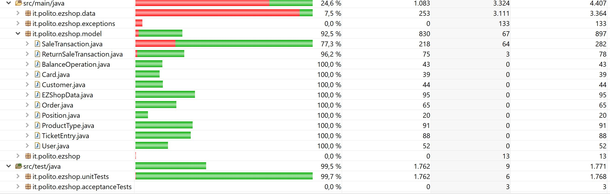

# Unit Testing Documentation

Authors: Amr Alashram, Davide Perticone, Andrea Taurino, Francesco Vaccaro 

Date: 19/05/2021

Version: 1.0

# Contents

- [Black Box Unit Tests](#black-box-unit-tests)

- [White Box Unit Tests](#white-box-unit-tests)

# Black Box Unit Tests

 ### **Class *it.polito.ezshop.data.EZShop* - method *checkBarCodeValidity***

  

**Criteria for method *checkBarCodeValidity*:**
	

 - barcode is null
 - barcode isBlank()
 - barcode is made of all digits
 - barcode length is correct (12,13 or 14)
 - barcode respect GS1. i.e. Last digit of the barcode is equal to the difference between the nearest (from the sum) equal or higher multiple of ten and the sum itself (sum of all the digits except of the last one) 

  

**Predicates for method *checkBarCodeValidity*:**

| Criteria | Predicate |
| -------- | --------- |
|   barcode validity  | null |
|| blank |
|| valid , all digits |
|| invalid, not all digits |
|   barcode length is correct (12,13 or 14)       |   yes   |
||no|
|   barcode respect GS1      |     yes      |
||no|

  

  

**Combination of predicates**:

| is null | isBlank() | is made of all digits | length is correct | respect GS1 | Valid / Invalid | Description of the test case | JUnit test case |
|-------|-------|-------|-------|-------|-------|-------|-------|
|true   |       |       |       |       |valid  |T1(null)--> true   |       |
|       |true   |       |       |       |valid  |T2("  ")-->true   |       |
|       |       |false  |       |       |valid  |T3("a1234")-->true   |       |
|       |       |true   |false  |       |valid  |T4("1234")-->true   |       |
|       |       |true   |true   |false  |valid  |T5("6291041500214")-->true   |       |
|       |       |true   |true   |true   |invalid|T6("6291041500213")-->false  |       |

  

### **Class *SaleTransaction* **

**Criteria for method *removeProduct(ProductType prod, Integer amount)*:**
	

- Sign of amount

- Validity of Item prod

- Existence of Item prod 
- Amount

**Predicates for method *name*:**

| Criteria                                            | Predicate                   |
| --------------------------------------------------- | --------------------------- |
| Sign of amount                                      | [minint, 0]                 |
|                                                     | [1, maxint]                 |
| Validity of Item prod                               | Valid                       |
|                                                     | NULL                        |
| Existence of Item prod inside Class SaleTransaction | Yes                         |
|                                                     | No                          |
| Amount                                              | >quantity previously added  |
|                                                     | <=quantity previously added |

**Boundaries**:

| Criteria       | Boundary values |
| -------------- | --------------- |
| Sign of amount | 0               |

**Combination of predicates**:

| Sign of amount | Validity of Item prod | Existence | Amount                       | Valid / Invalid | Description of the test case                 | JUnit test case |
| -------------- | --------------------- | --------- | ---------------------------- | --------------- | -------------------------------------------- | --------------- |
| -              | NULL                  | -         | -                            | Invalid         | T1(null, 5; false)                           |                 |
| -              | -                     | No        | -                            | Invalid         | T2(NotExProd, 5; false)                      |                 |
| [minint, 0]    | -                     | -         | -                            | Invalid         | T3(prod, -5 ; false) T3b(prod, 0; false) |                 |
| -              | -                     | -         | > quantity previously added  | Invalid         | T4(prod, 25; false)                          |                 |
| [1, maxint]    | Valid                 | Yes       | <=quantity previouosly added | Valid           | T4(prod, 5; true)                            |                 |

**Criteria for method *addProduct(ProductType prod, Integer amount)*:** 
	

 - Sign of amount
 - Validity of Item prod
 - Amount

**Predicates for method *name*:**

| Criteria              | Predicate                  |
| --------------------- | -------------------------- |
| Sign of amount        | [minint, 0]                |
|                       | [1, maxint]                |
| Validity of Item prod | Valid                      |
|                       | NULL                       |
| Amount                | >quantity present in prod  |
|                       | <=quantity present in prod |

**Combination of predicates**:

| Sign of amount | Validity of Item prod | Amount                     | Valid / Invalid | Description of the test case | JUnit test case |
| -------------- | --------------------- | -------------------------- | --------------- | ---------------------------- | --------------- |
| [minint, 0]    | -                     | -                          | Invalid         | T1(prod, -1; false)          |                 |
| -              | null                  | -                          | Invalid         | T2(null, 5; false)           |                 |
| -              | -                     | >quantity present in prod  | Invalid         | T3(prod, 30; false)          |                 |
| [1,maxint]     | Valid                 | <=quantity present in prod | Valid           | T4(prod, 5; true)            |                 |

  

### Class *it.polito.ezshop.data.EZShop* - method *checkLuhn*

**Criteria for method *checkLuhn*:**
	

- Validity of the String parameter

- Length of the String

- Validity of cardNo 

  

**Predicates for method *checkLuhn*:**

| Criterion                        | Predicate                 |
| -------------------------------- | ------------------------- |
| Validity of the String parameter | Valid                     |
|                                  | NULL                      |
|                                  | Not Valid, not all digits |
| Length of the String             | [0, 7]                    |
|                                  | [8, 19]                   |
|                                  | [20, maxint)              |
| Validity of cardNo               | true                      |
|                                  | False                     |

**Boundaries for method *checkLuhn***:

| Criterion | Boundary values |
| --------- | --------------- |
|           | 0, 7, 8, 19, 20 |

 **Combination of predicates for method *checkLuhn***

| Validity of cardNo | Length of the String | Validity of the String parameter | Valid/Invalid | Description of the test case                                 | JUnit test case        |
| ------------------ | -------------------- | -------------------------------- | ------------- | ------------------------------------------------------------ | ---------------------- |
| -                  | -                    | NULL                             | Invalid       | T1(NULL) -> error                                            | stringIsNull()         |
| -                  | <8                   | Valid                            | Invalid       | T2("421", false) T2b("", false) T2b2(*7 digits*, false) | cardLenghtLessThan8()  |
| -                  | >19                  | "                                | Invalid       | T3 -> false T3b(*20 digits*, false)                     | cardLenghtMoreThan18() |
| true               | [8,18]               | "                                | Valid         | T4("017235888619510", true) T4b1(*8 digits*, true) T4b2(*19 digits*, true) | cardValid()            |
| false              | "                    | "                                | Invalid       | T5("3316538977", false) T5b1(*8 digits*, false) T5b2(*19 digits*, false) | cardNotValid()         |
| -                  | *                    | not all digits                   | Invalid       | T6("33165f8977b", false)                                     | cardNotDigits()        |

  

  

### Class *it.polito.ezshop.model.ProductType* - method *AddQuantity*

**Criteria for method *AddQuantity*:**
	

- Validity of Integer quantity
- Sign of quantity

**Predicates for method *AddQuantity*:**

| Criterion                    | Predicate   |
| ---------------------------- | ----------- |
| Validity of Integer quantity | Valid       |
|                              | NULL        |
| Sign of  quantity            | (0, maxint) |
|                              | {0}         |
|                              | (minint, 0) |

**Boundaries for method *AddQuantity***:

| Criterion | Boundary values |
| --------- | --------------- |
|           | 1, -1           |

 **Combination of predicates for method *AddQuantity***

| Sign of  quantity | Validity of Integer quantity | Valid/Invalid | Description of the test case | JUnit test case     |
| ----------------- | ---------------------------- | ------------- | ---------------------------- | ------------------- |
| -                 | NULL                         | Not Valid     | T1(null; 0)                  | addQuantityNULLTest |
| {0}               | Valid                        | Not Valid     | T2(0; 0)                     | addQuantityZeroTest |
| (0, maxint)       | "                            | Valid         | T3(8, 8) T3b(1; 9)      | addQuantityPosTest  |
| (minint, 0)       | "                            | Valid         | T4(-8, -8) T4b(-1, -9)  | addQuantityNegTest  |

  
### **Class *it.polito.ezshop.data.EZShop* - method *checkPosition***

  

**Criteria for method *checkPosition*:**
	

 - Position is null
 - Position is not string
 - Position length is correct
 - Pattern is correct

  

**Predicates for method *checkPosition*:**

| Criteria | Predicate |
| -------- | --------- |
|   Position is null  | null |
|| String |
| Position is string | True |
|| False |
|   Position length is correct      |   < 3 Digits  |
||> 3 Digits|
|| = 3 Digits|
| Pattern correctness | Correct |
|| Incorrect |
|||

  

**Combination of predicates**:

| is null | is string | length is correct | Pattern is correct | Validity | Description of the test case | JUnit test case |
|---------|-----------|-------------------|--------------------|----------|------------------------------|-----------------|
|null     | *         | *                 |  *                 | Invalid  |  T1(null) --> False          |    TC1    |
| *       | False     | *                 |  *                 | Invalid  |  T2(1-2-3) --> False         |    TC2    |
| *       | *         |   > 3 Digits      |  *                 | Invalid  |  T3("1-2-3-4") --> False     |    TC3    |
| *       | *         |   < 3 Digits      |  *                 | Invalid  |  T4("1-2") --> False         |    TC3    |
| String  | True      |   = 3 Digits      | true               |  Valid   |  T8("1-2-3") --> True        |    TC3    |
| *       | *         | *                 | Incorrect          | Invalid  | T5("-1-2-3")--> False   T6("1-2-3-")--> False   T7("12-3") --> False | TC4  |

  

# White Box Unit Tests

### Test cases definition

    <JUnit test classes must be in src/test/java/it/polito/ezshop>
    <Report here all the created JUnit test cases, and the units/classes under test >
    <For traceability write the class and method name that contains the test case>

| Unit name | JUnit test case |
|--|--|
| SaleTransaction Class  | SaleTransactionTest: ConstructorTest, testGettersAndSetters |
| SaleTransaction: CalculatePrice | SaleTransactionTest: testCalculatePrice |
| User Class | TestUser: testGettersAndSetters |
| User: isAdmin | TestUser: testIsAdmin1, testIsAdmin2 |
| TicketEntry Class | TestTicketEntry: testSetters |
| TicketEntry: addAmount | TestTicketEntry: testAmount |
| TikcetEntry: setDiscountEntry | TestTicketEntry: testSetDiscountRate |
| ReturnSaleTransaction Class | TestReturnSaleTransaction: testIsCommitted |
| ReturnSaleTransaction: addReturnProduct | TestReturnSaleTransaction: testAddReturnProduct, testAddReturnProductNegativeAmount, testAddReturnProductCorrectAmount, testAddReturnProduct2 |
| Customer Class | TestCustomer: testConstructor, testInsertionOfCard, testOtherGettersAndSetters |
| ProductType Class | TestProductType: testContructor, testGettersAndSetters |
| BalanceOperation Class | TestBalanceOperation: testConstructor, testGettersAndSetters |
| Order Class | TestOrderPositionCard |
| Position Class | TestOrderPositionCard |
| Card Class | TestOrderPositionCard |
### Code coverage report

  

